# Camping Survivor — Game Design Document

> **Versión:** 1.2  
> **Estado:** GDD completo · v1.2 añade localización (§1.11, §10.22)  
> **Idioma del documento:** Español *(texto de diseño; el juego usa EN/ES — ver §1.11)*  
> **Idiomas del juego (v1.0):** Inglés (por defecto) · Español  
> **Plataforma:** Roblox (PC + móvil)

---

## Índice

1. [Visión y pilares](#1-visión-y-pilares) — incluye [§1.10 Monetización](#110-monetización--filosofía-y-límites) · [§1.11 Localización](#111-localización-e-idiomas)
2. [Core loop y sesión de juego](#2-core-loop-y-sesión-de-juego)
3. [Supervivencia](#3-supervivencia)
4. [Crafting e inventario](#4-crafting-e-inventario)
5. [Mundo, biomas y exploración](#5-mundo-biomas-y-exploración)
6. [Campamento y construcción](#6-campamento-y-construcción)
7. [Multijugador, clanes y raideo](#7-multijugador-clanes-y-raideo)
8. [Progresión, tutorial y misiones](#8-progresión-tutorial-y-misiones)
9. [Economía y monetización](#9-economía-y-monetización)
10. [UX, UI y feedback](#10-ux-ui-y-feedback)

---

## 1. Visión y pilares

### 1.1 Elevator pitch

**Camping Survivor** es un juego de supervivencia multijugador en Roblox donde cada jugador reclama su propio campamento en un mundo compartido lleno de bosques, montañas, pantanos y costa. Debes explorar, recolectar recursos, craftear herramientas y medicina, alimentarte, protegerte del frío, curar heridas y defender tu base — solo o en clan. Puedes encontrar **ayudantes** en el mundo que automatizan tareas concretas, pero exigen cuidado: hay que alimentarlos, curarlos y protegerlos; si mueren, se pierden para siempre. El progreso se guarda entre sesiones; los retos son reales pero siempre hay una forma de recuperarte si piensas, exploras y preparas.

### 1.2 Concepto en una frase

> *"Tu campamento es tu hogar. La naturaleza te da lo que necesitas — si aprendes a usarla. Y quien te ayuda, depende de ti."*

### 1.3 Público objetivo

| Segmento | Edad | Perfil | Qué buscan |
|----------|------|--------|------------|
| **Principal** | 10–16 años | Jugadores Roblox habituales | Progresión, crafteo, bases, multijugador |
| **Secundario** | 17–25 años | Fans de survival/crafting | Profundidad, exploración, estrategia |
| **Casual** | 8–12 años | Móvil, sesiones cortas | Tutorial claro, objetivos visibles, baja frustración |

**Plataformas:** PC y móvil desde el día uno. Toda mecánica debe funcionar con touch (botones grandes, gestos simples). No hay mecánicas exclusivas de teclado que bloqueen progreso en móvil.

**Sesión típica:** 15–45 minutos. El juego debe ser satisfactorio tanto en sesiones cortas (revisar campamento, craftear, explorar cerca) como largas (expedición a otro bioma, misiones, defensa).

### 1.4 Pilares de diseño

Estos cinco pilares guían **cada** decisión de diseño. Si una feature no refuerza al menos un pilar, no entra al juego.

#### Pilar 1 — Supervivencia con consecuencias

Las necesidades del jugador importan: hambre, sed, temperatura y salud crean tensión constante pero manejable. Tener frío no es un game over instantáneo — es una señal de que debes actuar (buscar fuego, refugio, ropa). Una mordedura de serpiente no mata al instante — te obliga a decidir: ¿vendaje de emergencia o antídoto crafteado con hierbas del pantano?

**Regla de diseño:** ningún stat vital llega a cero sin avisos previos (UI, sonidos, efectos visuales).

#### Pilar 2 — Exploración que enseña

El mundo no es decoración: es el tutorial avanzado. Las pistas están en el entorno (carteles, objetos, NPCs, restos de campamentos abandonados). Las recetas básicas se enseñan en el tutorial; las avanzadas se descubren explorando y conectando pistas.

**Regla de diseño:** cada bioma introduce al menos un recurso, un peligro y una pista de crafteo que no existe en biomas anteriores.

#### Pilar 3 — Progresión tangible

El jugador siempre siente que avanza: campamento más sólido, recetas nuevas, biomas desbloqueados, herramientas mejores, nivel de jugador. Incluso una sesión mala (muerte, raid) deja algo: experiencia, conocimiento del mapa, recetas descubiertas.

**Regla de diseño:** nunca más de 10 minutos sin un micro-logro visible (item nuevo, receta, misión completada, nivel de campamento).

#### Pilar 4 — Multijugador con propósito

Jugar con otros tiene sentido: clanes comparten base y defensa, el comercio intercambia recursos de biomas distintos, el raideo (desbloqueado a medio juego) añade riesgo/recompensa. No es un survival solitario con otros corriendo al lado — el social es parte del loop.

**Regla de diseño:** un jugador solo puede completar el 100% del contenido, pero clanes lo hacen más eficiente y seguro.

#### Pilar 5 — Compañeros con responsabilidad *(ayudantes)*

Los **ayudantes** son NPCs que encuentras explorando y que se unen a tu campamento para una **tarea específica** (recolectar madera, vigilar, pescar, craftear…). No son herramientas desechables: tienen hambre, salud y estados (heridas, enfermedad). Debes **alimentarlos**, **curarlos** y **protegerlos** de fauna y raids. Si un ayudante **muere por daño o enfermedad**, **no revive**: debes volver al mundo a buscar otro. Esto crea vínculo emocional y decisiones estratégicas — ¿expedición arriesgada con el guardián en la base o dejarlo solo expuesto a un raid?

**Regla de diseño:** cada ayudante aporta una ventaja clara pero añade al menos una obligación de mantenimiento (comida, medicina o defensa).

### 1.5 Tono y dificultad

**Tono:** equilibrado. No es hardcore (permadeath, recetas ocultas sin pistas) ni arcade (barras infinitas, sin peligro real).

| Aspecto | Enfoque |
|---------|---------|
| Curva de aprendizaje | Tutorial guiado 5 min → libertad gradual |
| Castigo por error | Suave: pierdes parte del loot, no todo |
| Recuperación | Siempre posible con tiempo y recursos |
| Información al jugador | Pistas en mundo + UI clara de stats |
| Fauna y peligros | Amenaza real pero evitable con preparación |

### 1.6 Qué hace único a Camping Survivor

Comparado con otros survival populares en Roblox:

| Aspecto | Camping Survivor | Típico en Roblox |
|---------|------------------|------------------|
| **Crafting** | Híbrido: tutorial enseña lo básico; lo avanzado se descubre con pistas en el mundo | Todo visible en menú desde el inicio, o todo oculto sin guía |
| **Curación** | Decisiones significativas: vendaje rápido vs medicina crafteada vs antídoto de bioma específico | Poción cura todo |
| **Base** | Parcela fija en mapa compartido; evoluciona con construcción y defensa | Base instanciada sin impacto en el mundo |
| **Multijugador** | Solo viable + clanes + raideo con reglas anti-frustración (escudo offline, ventanas) | PvP libre o co-op sin tensión |
| **Mundo** | Multi-bioma con recursos exclusivos que impulsan exploración | Mapa único plano |
| **Progreso** | Persistente con penalización suave en muerte; cofre seguro | Todo o nada |
| **Ayudantes** | NPCs especializados que hay que cuidar; muerte permanente del ayudante | Pets invencibles o workers sin mantenimiento |
| **Monetización** | Cosméticos + conveniencia + **boosts temporales con límite por periodo**; no pay-to-win | Ventaja permanente de combate o progreso exclusivo de pago |

### 1.7 Referencias de inspiración (mecánicas, no copia)

Estas referencias inspiran **sistemas**, no arte ni narrativa:

| Referencia | Qué tomamos |
|------------|-------------|
| **Don't Starve** | Gestión de hambre/salud/temperatura; importancia del fuego |
| **The Forest / Green Hell** | Crafting con lógica real (pedernal + yesca = fuego); heridas con tratamientos distintos |
| **Rust / Ark** | Base personal en mundo compartido; raideo como endgame social |
| **Stranded Deep** | Biomas con recursos exclusivos; progresión por islas/biomas |
| **99 Nights in the Forest** (Roblox) | Referencia de audiencia y tono accesible en Roblox |
| **Palworld / RimWorld** | Compañeros útiles con necesidades y riesgo de pérdida permanente |

**Lo que NO copiamos:** narrativa, estética, personajes ni mapas de estas referencias.

### 1.8 Decisiones de diseño cerradas

Estas decisiones ya están tomadas y no cambian salvo revisión explícita:

| Decisión | Elección |
|----------|----------|
| Estructura del mundo | Mapa compartido; parcela fija por jugador o clan |
| Persistencia | Siempre guardado entre sesiones |
| Muerte | Penalización suave (pierdes parte del loot, no todo) |
| Crafting | Híbrido: básico en tutorial, avanzado por descubrimiento |
| Biomas | Bosque → Montaña → Pantano → Costa |
| Multijugador | Solo y clanes; raideo a medio juego |
| Monetización | Cosméticos + conveniencia + boosts temporales acotados; no pay-to-win |
| Plataforma | PC + móvil desde el inicio |
| Ayudantes | Encontrables en el mundo; 1 especialidad cada uno; requieren comida/cura/protección; muerte permanente |
| **Idiomas del juego** | **Inglés (por defecto) + Español**; arquitectura extensible a más idiomas (§1.11) |

### 1.9 Ayudantes del campamento — Resumen de sistema

*(Reglas completas y números en §2.13, Cap. 3, Cap. 5 y Cap. 6.)*

Los ayudantes son **bots aliados** vinculados al campamento del jugador (o clan). No se compran con dinero real ni se craftean: se **encuentran** explorando, completando misiones o interactuando en biomas concretos.

| Principio | Regla |
|-----------|-------|
| **Especialización** | Cada ayudante domina **una tarea** (ej. talar, pescar, cocinar, vigilar, recolectar hierbas) |
| **Mantenimiento** | Tienen hambre y salud; pueden sufrir heridas y enfermedades |
| **Cuidado obligatorio** | El jugador debe alimentarlos, curarlos y proteger la base donde trabajan |
| **Muerte permanente** | Si mueren por daño, enfermedad o negligencia → **se pierden para siempre** |
| **Reemplazo** | Solo recuperable encontrando **otro** ayudante distinto en el mundo (puede ser del mismo tipo) |
| **Contraste con el jugador** | Tú mueres con penalización suave; el ayudante muere sin segunda oportunidad |

**Límite por campamento:** máx. **2 ayudantes** (solo) / **4 ayudantes** (clan). Detalle en Cap. 6.

### 1.10 Monetización — Filosofía y límites

*(Detalle de precios, moneda in-game y tienda en Cap. 9.)*

**Principio:** el juego es **completable y competitivo sin pagar**. Las compras con Robux ahorran tiempo o suavizan mala suerte, pero **nunca** otorgan ventaja permanente decisiva ni contenido exclusivo de pago. Todo boost de pago tiene **tope de compras por periodo** para evitar pay-to-win.

#### Tres capas de productos

| Capa | Qué incluye | Filosofía |
|------|-------------|-----------|
| **1. Cosméticos** | Skins de campamento, ropa, efectos de fogata, emotes | Puro estético; sin gameplay |
| **2. Conveniencia** | Slots extra de cofre, decoración, personalización de parcela | Ahorra molestias; no altera combate ni supervivencia base |
| **3. Boosts temporales** | Aceleración de curación, mayor probabilidad de comida/pistas, escudos temporales | Ayuda moderada; **siempre limitados por periodo** |

#### Boosts temporales permitidos (v0.1)

Productos consumibles (Developer Products) con efecto **limitado en tiempo** y **limitado en cantidad de compra**:

| Producto | Efecto | Duración | Límite de compra |
|----------|--------|----------|------------------|
| **Acelerador de curación** | Regeneración de salud +50% (jugador y ayudantes curables) | 15 min | Máx. **2 por día** |
| **Ojo del explorador** | +25% probabilidad de comida en nodos y de drop de pistas al explorar | 20 min | Máx. **1 por día** |
| **Escudo de campamento** | Bloquea el próximo intento de raid contra tu parcela, o reduce botín robable un 50% si falla el bloqueo total | 2 h | Máx. **1 cada 48 h** |
| **Kit supervivencia** | 3 raciones básicas + 2 vendajes (equivalente a ~20 min de farmeo, no items raros) | Instantáneo | Máx. **3 por semana** |

**Reglas anti-abuso de boosts:**
- Los boosts **no se apilan** del mismo tipo (activar uno nuevo reemplaza o espera al anterior).
- Tras alcanzar el límite del periodo, el producto aparece **agotado** hasta el reset (medianoche UTC o rolling 24 h — definir en Cap. 9).
- Los límites aplican **por cuenta**, no por servidor ni por clan.
- En **raideo**, el escudo de pago no anula ventanas de raid del atacante: solo protege al defensor dentro de las reglas del Cap. 7.

#### Qué NO se vende (lista cerrada)

| Prohibido | Motivo |
|-----------|--------|
| Armas, daño o armadura superior | Ventaja directa de combate |
| Recetas o biomas bloqueados | Contenido exclusivo de pago |
| Ayudantes o slots de ayudante | Rompe el pilar de compañeros con responsabilidad |
| Revivir ayudantes muertos | Muerte permanente es regla de diseño |
| Inmunidad permanente a raids | Destruye el loop multijugador |
| Stats vitales infinitos / sin hambre | Elimina supervivencia |
| Moneda premium que compre ventaja en PvP | Pay-to-win encubierto |

#### Relación con jugador free-to-play

Un jugador que **nunca paga** puede:
- Descubrir todas las recetas, biomas y ayudantes.
- Competir en raids y clanes al mismo nivel.
- Curarse, alimentarse y defenderse solo con crafteo y exploración.

Un jugador que **paga ocasionalmente** obtiene:
- Recuperación más rápida tras un error (curación acelerada).
- Menos fricción buscando comida o pistas (explorador).
- Una red de seguridad ante raid (escudo temporal acotado).

**Regla de diseño:** ningún boost temporal debe reducir el tiempo para completar un hito principal (ej. campamento nv. 3) en más de **~15–20%** frente a un jugador F2P competente.

### 1.11 Localización e idiomas

El juego es **multilingüe desde el diseño**. Toda cadena visible al jugador (UI, items, misiones, diálogos, toasts, tienda) pasa por un sistema de localización centralizado — no se hardcodean textos finales en controllers ni ScreenGui.

#### Idiomas v1.0

| Código | Idioma | Rol |
|--------|--------|-----|
| **`en`** | English | **Idioma por defecto** (fallback global) |
| **`es`** | Español | Lanzamiento day-one |

#### Principios

| Principio | Regla |
|-----------|-------|
| **Default** | Primer acceso y jugadores sin preferencia guardada → **`en`** |
| **Extensible** | Añadir `pt`, `fr`, etc. = nuevo archivo de locale + registro; sin refactor de UI |
| **Fallback** | Clave ausente en locale activo → **`en`** → en Studio/dev mostrar clave entre corchetes |
| **GDD vs juego** | Este GDD está en español (autoría interna); los textos in-game viven en **tablas de traducción**, no en el GDD |
| **Persistencia** | Preferencia en `PlayerProfile.settings.locale` (`"en"` \| `"es"`) |
| **Detección opcional** | Puede sugerir idioma inicial con `LocalizationService:GetCountryRegionForPlayerAsync` / locale del cliente, pero **nunca** fuerza sin confirmación en tutorial o ajustes |
| **Servidor autoritativo** | El servidor valida `locale` en peticiones (whitelist); el cliente solo **muestra** traducciones |

#### Qué se localiza

| Categoría | Ejemplos | Clave sugerida |
|-----------|----------|----------------|
| UI / HUD | Barras, menús, botones | `ui.hud.hunger`, `ui.menu.settings` |
| Alertas | "¡Hambre!", toasts raid | `alert.hunger`, `toast.raid.incoming` |
| Items | Nombre y descripción | `item.stick.name`, `item.stick.desc` |
| Recetas | Nombre craft | `recipe.sparks.name` |
| Misiones | Título, objetivo, recompensa | `quest.t01.title` |
| Diálogos NPC | Líneas tutorial / ermitaño | `dialogue.hermit.intro_01` |
| Tienda / monetización | Nombres producto (Roblox traduce descripción DP en parte) | `shop.pass.extra_chest` |

#### Qué NO se localiza en tablas (datos, no copy)

- IDs de items, recetas, misiones (`stick`, `recipe_sparks`, `t01_gather`)
- Números de balance, daño, stacks
- Payloads de red (snapshots con IDs; el cliente resuelve texto)

#### Selector de idioma (UX)

| Ubicación | Comportamiento |
|-----------|----------------|
| **Tutorial** (opcional paso 0) | "Choose your language / Elige tu idioma" — `en` preseleccionado |
| **Ajustes** | Dropdown o lista: English · Español; cambio instantáneo en UI |
| **Rejoin** | Aplica `settings.locale` guardado |

#### Formato de cadenas

- Placeholders nombrados: `"You lost {percent}% inventory"` → `ui.death.inventory_loss`
- Pluralización: claves separadas o función `format(key, { count = n })` según idioma
- Longitud máxima recomendada en móvil: títulos ≤24 caracteres; botones ≤16

#### Roadmap de idiomas (post v1.0)

| Fase | Idiomas candidatos |
|------|-------------------|
| v1.0 | `en`, `es` |
| v1.x | `pt-BR`, `fr` (según métricas de audiencia Roblox) |

*(Implementación técnica: §10.22, `openspec/specs/localization/spec.md`.)*

---

## 2. Core loop y sesión de juego

### 2.1 Loop principal (macro)

El ciclo que repite un jugador durante toda su vida en el juego:

```
ENTRAR → REVISAR CAMPAMENTO → CUIDAR AYUDANTES → PREPARARSE → EXPLORAR → RECOLECTAR
    → CRAFTEAR / CURAR / ALIMENTARSE → VOLVER A BASE → GUARDAR LOOT
    → MEJORAR BASE → DESBLOQUEAR CONTENIDO → (repeat)
```

En fases avanzadas se añade: **DEFENDER BASE** (y a tus ayudantes), **RAIDEAR**, **COMERCIAR**, **MISIONES DE CLAN**, **BUSCAR NUEVOS AYUDANTES** si perdiste alguno.

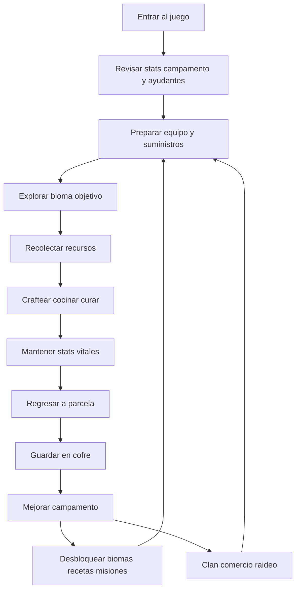

### 2.2 Loop minuto a minuto (micro)

Lo que ocurre en 1–5 minutos de gameplay activo:

1. **Evaluar** — Mirar barras de hambre, sed, temperatura, salud y estados activos (sangrado, veneno…). Revisar estado de ayudantes en campamento.
2. **Decidir objetivo** — ¿Necesito comida? ¿Madera? ¿Hierbas medicinales? ¿Completar misión?
3. **Actuar** — Moverse, recolectar, combatir/huir, craftear.
4. **Reaccionar** — Responder a eventos: animal que aparece, tormenta, herida, noche que cae.
5. **Ajustar** — Si un stat baja demasiado, cambiar prioridad (dejar de farmear madera y buscar comida).

**Ritmo objetivo:** alternancia entre tensión (exploración, peligro) y alivio (campamento seguro, crafteo, cocinar junto al fuego).

### 2.3 Loop hora a hora (meso)

Progresión típica dentro de una sesión larga (~1 hora):

| Fase | Tiempo | Actividad | Sensación |
|------|--------|-----------|-----------|
| **Arranque** | 0–5 min | Spawn en parcela, revisar stats, recoger lo básico cerca | Seguridad, rutina |
| **Preparación** | 5–15 min | Craftear/equipar, comer, beber, encender fogata si hace frío | Planificación |
| **Expedición** | 15–35 min | Viajar a zona de farmeo o bioma, recolectar, enfrentar peligros | Tensión, descubrimiento |
| **Regreso** | 35–45 min | Volver a base antes de que stats críticos caigan | Urgencia controlada |
| **Consolidación** | 45–55 min | Guardar loot, craftear mejoras, construir/reparar, alimentar y curar ayudantes | Satisfacción, progreso |
| **Cierre** | 55–60 min | Dejar suministros listos para la próxima sesión | Preparación futura |

### 2.4 Sesión típica por tipo de jugador

#### Jugador casual (15–20 min, móvil)

1. Entra → ve notificación de hambre bajo.
2. Recolecta bayas cerca del campamento.
3. Craftea 1–2 items simples.
4. Completa 1 misión diaria.
5. Guarda loot en cofre → sale.

**Diseño para este jugador:** misiones diarias, recursos cerca de la parcela, acciones en ≤3 taps.

#### Jugador estándar (30–45 min)

1. Prepara expedición al bosque profundo o borde de montaña.
2. Farmea recursos específicos para una receta descubierta.
3. Enfrenta fauna, cura una herida.
4. Vuelve, guarda, mejora una estructura del campamento.
5. Sube un nivel o desbloquea pista de receta.

#### Jugador avanzado / clan (45+ min)

1. Coordina con clan qué recursos faltan.
2. Expedición a bioma lejano (pantano para hierbas).
3. Participa en evento dinámico o defiende base de raid.
4. Comercia excedentes con otro jugador.
5. Planifica próximo upgrade de campamento nivel 3+.

### 2.5 Onboarding — Primeros 5 minutos

Objetivo: el jugador entiende **dónde está**, **qué necesita** y **cómo hacer fuego** (mecánica icónica del juego).

| Paso | Tiempo | Qué ocurre | Qué aprende |
|------|--------|------------|-------------|
| 1 | 0:00 | Spawn en zona segura junto a su parcela vacía. UI muestra barras vitales. | Tengo un campamento; tengo necesidades |
| 2 | 0:30 | NPC guía o panel tutorial: "Recoge 3 palos y 2 piedras". Nodos brillantes cerca. | Cómo recolectar |
| 3 | 1:30 | "Combina pedernal + palo para hacer chispas". Acción de craft guiada. | Crafting básico |
| 4 | 2:30 | "Usa yesca + chispas para encender fogata en tu parcela". Fogata se coloca. | Fuego = calor + cocina |
| 5 | 3:30 | Temperatura baja ligeramente (simular noche). "Mantente cerca del fuego". | El frío es real; el fuego salva |
| 6 | 4:30 | "Craftea un vendaje (hojas + palo)". Misión completada. Recompensa: bayas + pequeño XP. | Curación básica; completar misiones da recompensa |
| 7 | 5:00 | Tutorial principal completado. Se desbloquea exploración libre con 1 misión activa: "Recolecta 5 madera". | Libertad con objetivo claro |

**Regla:** durante el tutorial, el jugador no puede morir. La fauna agresiva no spawna cerca de la zona tutorial.

### 2.6 Onboarding — Primera hora

| Minutos | Hito | Desbloqueo |
|---------|------|------------|
| 5–15 | Completar misiones de campamento básico (fogata, vendaje, hacha) | Mesa de craft, cofre |
| 15–30 | Primera exploración más allá de la zona segura; recolectar madera y comida | Mapa parcial del bosque |
| 30–45 | Primer encuentro con fauna (lobo o serpiente); usar vendaje | Status effects, combate/huida |
| 45–60 | Campamento nivel 1 completo (fogata + cofre + mesa craft); primera receta descubierta por pista | Acceso a misiones del bosque profundo |
| 50–60 | *(Opcional)* Primer ayudante: misión "El leñador perdido" en bosque profundo | Introducción al sistema de ayudantes |

**Al final de la primera hora**, el jugador debe poder responder:
- ¿Cómo hago fuego?
- ¿Cómo curo una herida?
- ¿Dónde guardo mis cosas?
- ¿Qué pasa si me muero? *(introducido en Cap. 3)*

### 2.7 Onboarding — Primer día (3–5 horas acumuladas)

| Hito | Contenido |
|------|-----------|
| Campamento nivel 2 | Muro básico + puerta + 2ª fogata o olla |
| Exploración montaña (borde) | Descubrir frío extremo y minerales |
| Primera receta avanzada | Desinfectante o arco rudimentario (vía pista) |
| Sistema de misiones | Cadena de 3–5 misiones del ermitaño/bosque |
| Introducción clanes | Panel informativo: "¿Quieres unirte a un clan?" (opcional) |
| Primer ayudante | Encontrar y reclutar 1 ayudante (típico: Leñador o Cocinero); aprender a alimentarlo |
| Muerte y recuperación | Probablemente habrá muerto 1 vez; entiende penalización suave |

**Raideo NO disponible** el primer día. Escudo total de novato activo (< 24 h de tiempo de juego).

### 2.8 Fases de progresión del jugador

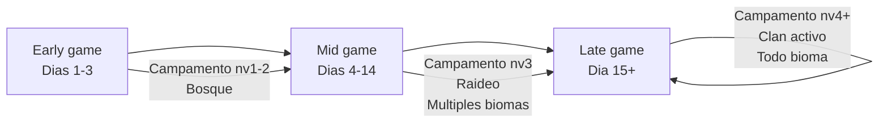

| Fase | Duración estimada | Foco | Contenido clave |
|------|-------------------|------|-----------------|
| **Early game** | Días 1–3 | Aprender a sobrevivir | Tutorial, bosque, craft básico, campamento nv. 1–2 |
| **Mid game** | Días 4–14 | Expandir y arriesgar | Montaña, pantano, raideo, clanes, 2º ayudante, campamento nv. 3 |
| **Late game** | Día 15+ | Dominar y competir | Costa, todas las recetas, defensa avanzada, raids estratégicos, campamento nv. 4+ |

### 2.9 "No sé qué hacer" — Sistema de guía

Cuando el jugador se queda sin objetivos claros, el juego le da dirección sin romper la inmersión:

| Mecanismo | Cómo funciona |
|-----------|---------------|
| **Misiones activas** | Siempre hay al menos 1 misión principal y 1 secundaria disponible |
| **Journal de descubrimiento** | Lista recetas por descubrir con pistas vagas ("Una hierba roja crece donde el agua estanca…") |
| **Alertas de stats** | "Tienes hambre" / "Hace frío" → implica acción concreta |
| **Mapa con marcadores** | Zonas inexploradas, biomas bloqueados con requisito visible |
| **Misiones diarias** | 3 tareas rotativas (recolectar, craftear, explorar) con recompensa |
| **Eventos dinámicos** | Notificación: "Manada de lobos cerca del río" → oportunidad/opeligro |

**Regla:** nunca más de 3 minutos idle sin que aparezca al menos una sugerencia de acción (misión, alerta o evento).

### 2.10 Interrupciones al loop — Eventos que rompen la rutina

Para que el juego no sea solo farmear en bucle, estos eventos inyectan variedad:

| Evento | Frecuencia | Efecto |
|--------|------------|--------|
| **Noche** | Cada ~15 min reales | Más frío; fauna nocturna más agresiva |
| **Tormenta** | Aleatorio, ~1 cada 20 min | Mojado; visibilidad reducida; fuego se apaga si no está protegido |
| **Manada** | Aleatorio, ~1 cada 30 min en zona | Grupo de lobos patrulla un área |
| **NPC viajero** | ~1 cada 25 min en camino | Comercio temporal o misión |
| **Pista nueva** | Al explorar zona inexplorada | Item de lore que desbloquea receta |
| **Raid entrante** | Mid game+, ventana de raid | Otro jugador intenta robar tu cofre; ayudantes pueden resultar heridos |
| **Ayudante enfermo** | Si hambre/salud baja | Notificación: "Tu leñador necesita comida" / "Tu pescador está herido" |

### 2.11 Flujo de una decisión típica: "Tengo frío"

Ejemplo concreto del tipo de gameplay dinámico que buscamos:

1. **Señal:** barra de temperatura baja; personaje tirita; sonido de viento.
2. **Opciones inmediatas:**
   - Acercarse a fogata existente (si hay una encendida).
   - Encender fuego portable (pedernal + yesca + palo — requiere tener items).
   - Equipar abrigo crafteado (si lo tiene).
   - Entrar al refugio/muro del campamento.
3. **Si no actúa:** stat "Frío severo" → pérdida de salud gradual.
4. **Lección:** siempre llevar yesca + pedernal en expedición; construir refugio en campamento.

Este patrón (señal → opciones → consecuencia → lección) se repite para hambre, sed, heridas y veneno.

### 2.12 Flujo de una decisión típica: "Me mordió una serpiente"

1. **Señal:** status "Veneno" (icono verde); salud baja gradualmente.
2. **Opciones:**
   - **Vendaje:** no cura veneno; solo ralentiza un poco el daño (emergencia).
   - **Antídoto:** requiere `HierbaRoja` (pantano) + `AguaHervida`; cura completamente (requiere haber encontrado la pista).
   - **Huir a base y preparar antídoto:** viable si tiene los materiales guardados en cofre.
3. **Si no actúa:** muerte en ~3–5 min.
4. **Lección:** explorar pantano antes de aventurarse en zonas con serpientes; guardar antídoto en cofre.

*(Números exactos en [Cap. 3 — Supervivencia](#3-supervivencia).)*

### 2.13 Ayudantes del campamento — Reglas de jugabilidad

Los ayudantes extienden el loop de supervivencia: **delegas una tarea**, pero **asumes responsabilidad** por su bienestar.

#### Cómo se obtienen

| Método | Cuándo | Ejemplo |
|--------|--------|---------|
| **Misión principal** | Mid early game (≈ hora 2–4 de juego) | "El leñador perdido" en bosque profundo |
| **Exploración / bioma** | Al entrar por primera vez a un bioma | Pescador herido en costa (requiere curarlo para reclutarlo) |
| **Evento dinámico** | Aleatorio | Viajero que se queda si le das comida y refugio 3 días |
| **NO disponible** | — | Tienda, game pass, crafteo |

Cada ayudante tiene **nombre**, **especialidad única** y **bioma de origen** (dónde suelen aparecer otros del mismo tipo si hay que reemplazarlo).

#### Especialidades (v0.1)

| Tipo | Tarea automatizada | Requisito en campamento | Bioma típico |
|------|-------------------|-------------------------|--------------|
| **Leñador** | Recolecta madera en radio de la parcela | Hacha en cofre o fogata activa | Bosque |
| **Cocinero** | Prepara comida básica si hay ingredientes en cofre | Fogata + olla | Bosque |
| **Pescador** | Genera pescado crudo periódicamente | Parcela cerca de agua o "muelle" construido | Costa |
| **Herbalista** | Recolecta 1 hierba común / ciclo | Mesa de craft | Pantano |
| **Guardián** | Alerta de raid; reduce daño a estructuras un 20% | Muro básico | Montaña |
| **Minero** | Recolecta piedra/mineral lento | Pico en cofre | Montaña |

*(Lista ampliable en Cap. 5 y Cap. 6. Máx. 1 ayudante del mismo tipo por campamento.)*

#### Necesidades del ayudante

Los ayudantes comparten un subconjunto del sistema de supervivencia del jugador:

| Stat | Comportamiento | Si llega a 0 |
|------|----------------|--------------|
| **Hambre** | −3/min mientras trabaja; +40/+60 al alimentar (§3.8) | A 0 → `weak` (deja de trabajar) → **20 min** sin comida = **muerte permanente** |
| **Salud** | Baja por ataques (fauna, raid), enfermedad o negligencia (hambre crítica) | **Muerte permanente** al llegar a 0 |
| **Estados** | Sangrado, veneno, infección, frío (mismos que jugador, tasas algo más lentas) | Requieren vendaje/medicina aplicada por el jugador |

**Regla clave:** el jugador **no muere** por penalización suave; el ayudante **sí muere para siempre** si no lo cuidas.

#### Cuidado y protección

| Acción del jugador | Efecto |
|--------------------|--------|
| **Alimentar** | Arrastrar comida al ayudante o marcar "auto-alimentar desde cofre" (consume tu stock) |
| **Curar** | Usar vendaje, desinfectante o antídoto en el ayudante (mismos items que para ti) |
| **Proteger** | Construir muros, mantener fogata de noche, no irte de raid dejando base indefensa |
| **Ordenar refugio** | Comando "Refugio": deja de trabajar y se acerca a fogata/muro (menos eficiencia, más seguridad) |

Durante **raids**, los ayudantes no combaten como jugadores: pueden **resultar heridos** si la base es vulnerable. Un guardián reduce probabilidad de herida en otros ayudantes.

#### Muerte y reemplazo

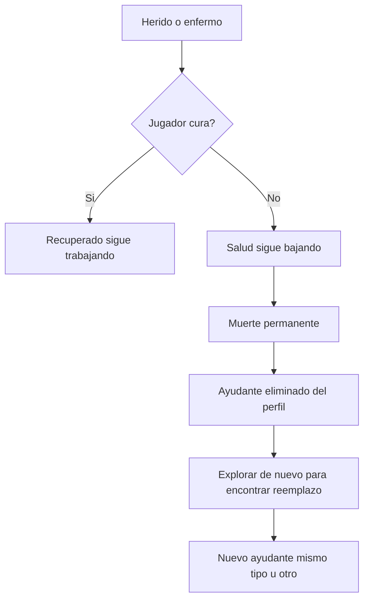

- **No hay resurrección**, **no hay pago** para revivir, **no hay backup** en cofre.
- El perfil guarda IDs de ayudantes perdidos solo para logros ("Perdiste a Roble el Leñador").
- Encontrar un reemplazo del **mismo tipo** puede requerir volver al bioma de origen o repetir misión equivalente.

#### Integración en el loop

1. **Al entrar:** revisar panel de ayudantes (hambre, salud, tarea activa).
2. **Antes de expedición larga:** asegurar comida en cofre + fogata + refugio activado si hay riesgo de raid/noche.
3. **Tras raid o tormenta:** revisar si algún ayudante quedó herido.
4. **Si muere:** notificación emocional clara + misión secundaria "Buscar un nuevo ayudante".

#### Límites anti-abuso

- Máx. **2 ayudantes** (jugador solo) / **4** (clan).
- No se pueden intercambiar entre jugadores.
- No acumular ayudantes en inventario: o están activos en parcela o no los tienes.
- **Monetización:** no se venden ayudantes, slots de ayudante ni revivir muertos. Los boosts de pago (curación, pistas, escudo) aplican con los límites de §1.10.

*(Stats numéricos en [§3.8 Ayudantes](#38-supervivencia-de-ayudantes).)*

### 2.14 Meta a largo plazo

Qué mantiene al jugador volviendo después de 2+ semanas:

| Meta | Descripción |
|------|-------------|
| **Campamento perfecto** | Nivel máximo, totalmente amueblado y defendido |
| **Recetario completo** | Descubrir todas las recetas del juego |
| **Dominio de biomas** | Haber explorado y farmeado cada zona eficientemente |
| **Clan top** | Clan reconocido; base impenetrable o temida |
| **Cazador de raids** | Reputación como raider exitoso (sin ser tóxico) |
| **Coleccionista** | Items raros, cosméticos, logros |
| **Equipo de confianza** | Conseguir y mantener vivo un roster completo de ayudantes especializados |

---

## 3. Supervivencia

El sistema de supervivencia es el corazón mecánico del juego. El servidor es **autoritativo**: todos los cálculos de stats, daño y curación ocurren en el servidor; el cliente solo muestra el estado.

### 3.1 Principios de diseño

| Principio | Regla |
|-----------|-------|
| **Escala unificada** | Stats vitales en escala **0–100** (enteros) |
| **Tick del servidor** | Cada **6 segundos** (10 ticks/minuto) |
| **Avisos antes del castigo** | Umbrales visuales y sonoros al 40%, 25% y 10% |
| **Recuperación posible** | Ningún stat llega a 0 en menos de **8 min** sin ignorar avisos |
| **Contraste jugador vs ayudante** | Jugador: muerte con penalización suave. Ayudante: muerte **permanente** |

### 3.2 Stats vitales del jugador

| Stat | Valor inicial | Rango | Descripción |
|------|---------------|-------|-------------|
| **Salud (HP)** | 100 | 0–100 | Muerte a 0 |
| **Hambre** | 80 | 0–100 | 100 = lleno |
| **Sed** | 80 | 0–100 | 100 = hidratado |
| **Temperatura** | 50 | 0–100 | 50 = confortable; valores bajos = frío |

#### Drenaje pasivo (por minuto)

| Stat | Tasa base | Modificadores |
|------|-----------|---------------|
| **Hambre** | −1/min | Correr: −0.5 extra/min. Combate: −0.3 extra/min |
| **Sed** | −1.5/min | Correr: −1 extra/min. Bioma caliente (costa día): −0.5 extra/min |
| **Temperatura** | Tendencia hacia **temperatura ambiente** del bioma | Ver §3.4 |

#### Daño a salud por stats críticos

| Condición | Efecto en salud |
|-----------|-----------------|
| Hambre ≤ 20 | −0.5 HP/min |
| Hambre ≤ 10 | −1 HP/min (acumulable con lo anterior → −1.5 total) |
| Sed ≤ 15 | −1 HP/min |
| Sed ≤ 5 | −2 HP/min |
| Temperatura ≤ 15 (frío severo) | −2 HP/min |
| Temperatura ≥ 85 (calor extremo) | −0.5 HP/min + sed extra (+1/min) |

**Regla:** el daño por hambre/sed/temperatura **no apila** más de **−4 HP/min** en total (techo de seguridad anti-spike).

#### Regeneración de salud

| Condición | Regeneración |
|-----------|--------------|
| Base (hambre > 40, sed > 30, sin estados negativos) | +0.5 HP/min |
| Bien alimentado (hambre > 60, sed > 50) + en parcela o fogata | +1 HP/min |
| Durmiendo / sentado en refugio (futuro) | +1.5 HP/min |
| **Boost:** Acelerador de curación (§1.10) | +50% sobre la tasa activa |

No hay regeneración si: sangrando, envenenado, infectado, o hambre/sed en zona crítica.

### 3.3 Restauración de stats

| Acción | Hambre | Sed | Temperatura | Salud |
|--------|--------|-----|-------------|-------|
| **Bayas / comida cruda** | +10–15 | — | — | — |
| **Comida cocinada** | +25–35 | — | — | +5 instantáneo |
| **Agua limpia** | — | +30 | — | — |
| **Agua sucia** | — | +15 | — | 15% probabilidad enfermedad |
| **Fogata (radio 8 studs)** | — | — | +5/min hacia 50 | — |
| **Refugio cerrado** | — | — | +3/min hacia 50 | — |
| **Abrigo crafteado** | — | — | Reduce pérdida de temp un 50% | — |
| **Vendaje** | — | — | — | Detiene sangrado |
| **Desinfectante** | — | — | — | Cura infección |
| **Medicina herbal** | — | — | — | +20 HP instantáneo |
| **Antídoto** | — | — | — | Cura veneno |

### 3.4 Temperatura y ambiente

La temperatura del jugador **tiende** hacia la temperatura ambiente del bioma/clima. No es un stat independiente del mundo.

#### Temperatura ambiente por contexto

| Contexto | Temp. ambiente objetivo |
|----------|-------------------------|
| Bosque (día) | 45 |
| Bosque (noche) | 25 |
| Montaña (día) | 30 |
| Montaña (noche) | 10 |
| Pantano | 40 |
| Costa (día) | 55 |
| Tormenta (cualquier bioma) | −10 al valor base |
| Junto a fogata (radio 8 studs) | 55 (override local) |
| Dentro de refugio | 50 (override local) |

**Velocidad de cambio:** el stat del jugador se mueve hacia la ambiente a **2 puntos/min** (sin abrigo). Con abrigo: **1 punto/min**.

**Noche en bosque sin fogata:** ambiente 25 → el jugador baja ~2/min desde 50 hasta entrar en frío severo (~15 min).

#### Estado: Mojado

| Propiedad | Valor |
|-----------|-------|
| **Origen** | Tormenta, nadar, cruzar río |
| **Efecto** | Velocidad de pérdida de temperatura ×2 |
| **Duración** | Hasta secarse junto a fogata (2 min) o en refugio (5 min) |
| **Curación** | Capa impermeable previene el estado |

### 3.5 Status effects (estados)

Los estados se aplican **además** de los stats vitales. Un jugador puede tener **múltiples estados** simultáneos.

| ID | Nombre | Origen | Efecto | Duración | Cura |
|----|--------|--------|--------|----------|------|
| `bleeding` | Sangrado | Ataque fauna, caída, raid | −1 HP cada 10 s (−6/min) | Hasta curar | **Vendaje** |
| `poison` | Veneno | Serpiente | −2 HP/min | Hasta curar o muerte | **Antídoto** |
| `infection` | Infección | Sangrado sin tratar 5 min | −1 HP/min; bloquea regen | Hasta curar | **Desinfectante** + vendaje |
| `severe_cold` | Frío severo | Temp ≤ 15 | −2 HP/min (ya contado en §3.2) | Hasta temp > 25 | Fogata, refugio, abrigo |
| `wet` | Mojado | Lluvia, agua | Temp ×2 decay | Ver §3.4 | Fogata, refugio, capa |
| `weak` | Debilitado | Hambre ayudante a 0 (solo ayudantes) | Deja de trabajar | Ver §3.8 | Comida |

#### Interacciones entre curas (filosofía del Cap. 2.12)

| Situación | Vendaje | Medicina herbal | Antídoto |
|-----------|---------|-----------------|----------|
| **Sangrado** | ✅ Cura | +10 HP pero no detiene sangrado | ❌ |
| **Veneno** | ⚠️ Reduce daño a −1.5 HP/min | ❌ | ✅ Cura |
| **Infección** | ⚠️ Necesario pero no suficiente | ❌ | ❌ |
| **HP bajo sin estado** | ❌ | ✅ +20 HP | ❌ |

**Vendaje con veneno:** el jugador gana ~2–3 min extra para reaccionar; no sustituye al antídoto.

**Infección:** si `bleeding` dura **5 min** sin vendaje → transición automática a `infection`.

### 3.6 Muerte, respawn y penalización suave

#### Muerte del jugador

| Trigger | Resultado |
|---------|-----------|
| HP ≤ 0 | Muerte |

#### Penalización

| Qué pasa | Detalle |
|----------|---------|
| **Inventario perdido** | **35%** de items del inventario **no equipado**, elegidos al azar (redondeo hacia arriba) |
| **Inventario protegido** | Items **equipados** (herramienta en mano, abrigo) |
| **Cofre del campamento** | **100% seguro** — nada se pierde del cofre |
| **Ayudantes** | **No mueren** por la muerte del jugador; siguen en parcela |
| **Recetas / progreso** | Se mantienen |
| **Campamento / parcela** | Se mantiene |

#### Respawn

| Propiedad | Valor |
|-----------|-------|
| **Ubicación** | Punto de spawn de la parcela (o clan) |
| **Salud** | 100 |
| **Hambre / Sed** | 60 / 60 |
| **Temperatura** | 50 |
| **Estados** | Todos eliminados |
| **Cooldown** | 3 s invulnerable (anti spawn-kill) |
| **Tutorial** | Sin penalización de inventario hasta completar tutorial |

**Contraste:** el jugador siempre puede recuperarse. Un ayudante muerto **no** respawnea (§3.8).

### 3.7 Tabla de balance v0.1 — Referencia rápida

#### Tiempos hasta crisis (sin actuar, desde stat lleno)

| Stat | Umbral crítico | Tiempo aprox. desde 100 |
|------|----------------|-------------------------|
| Hambre → daño HP | ≤ 20 | ~80 min |
| Sed → daño HP | ≤ 15 | ~57 min |
| Frío (bosque noche, sin fuego) | temp ≤ 15 | ~12 min desde 50 |
| Veneno → muerte | sin cura | ~50 min desde 100 HP (−2/min) |
| Sangrado → muerte | sin cura | ~17 min desde 100 HP (−6/min) |

#### Daño de fauna (referencia PvE)

| Fuente | Daño instantáneo | Estado aplicado |
|--------|------------------|-----------------|
| Lobo (mordisco) | −15 HP | `bleeding` 60% probabilidad |
| Serpiente | −8 HP | `poison` 100% |
| Oso | −25 HP | `bleeding` 100% |
| Caída (altura) | −10 a −30 HP | `bleeding` si > −20 HP |
| Cangrejo (costa) | −5 HP | — |

#### Umbrales de alerta UI

| Stat | Advertencia (amarillo) | Peligro (rojo) |
|------|------------------------|----------------|
| HP | ≤ 40 | ≤ 20 |
| Hambre | ≤ 40 | ≤ 20 |
| Sed | ≤ 35 | ≤ 15 |
| Temperatura | ≤ 30 o ≥ 70 | ≤ 15 o ≥ 85 |

### 3.8 Supervivencia de ayudantes

Los ayudantes usan un subconjunto simplificado del sistema del jugador. **No tienen sed ni temperatura** (permanecen en parcela); sí tienen **hambre**, **salud** y **estados** (`bleeding`, `poison`, `infection`, `weak`).

#### Stats del ayudante

| Stat | Inicial | Muerte en |
|------|---------|-----------|
| **Salud** | 100 | 0 = **muerte permanente** |
| **Hambre** | 100 | Ver cadena abajo |

#### Cadena de hambre (ayudante)

| Fase | Hambre | Comportamiento |
|------|--------|----------------|
| Normal | > 20 | Trabaja con normalidad |
| Hambriento | 11–20 | Trabaja al **50%** eficiencia; alerta UI |
| Debilitado (`weak`) | 0 | **Deja de trabajar**; alerta urgente |
| Muerte por negligencia | 0 durante **20 min** en `weak` | **Muerte permanente** |

**Alimentar:** +40 hambre por ración básica; +60 por comida cocinada. Auto-alimentar desde cofre consume el stock del jugador.

#### Daño al ayudante

| Fuente | Daño | Notas |
|--------|------|-------|
| Raid (base vulnerable) | −10 a −25 HP por evento de raid | Guardián reduce probabilidad 50% |
| Fauna que entra en parcela | −15 HP + `bleeding` | Solo si no hay muro |
| Tormenta sin refugio | −5 HP/evento | Menor que jugador en expedición |
| Negligencia hambre | Muerte tras 20 min en `weak` | Prevenible |

**Estados en ayudantes:** mismas tasas de daño que el jugador pero ×**0.8** (poison −1.6/min, bleeding −4.8/min). Mismos items de cura.

#### Muerte permanente del ayudante

| Regla | Detalle |
|-------|---------|
| Trigger | HP ≤ 0 **o** 20 min en `weak` |
| Persistencia | Se elimina del perfil del jugador/clan |
| Reemplazo | Solo encontrando otro en el mundo |
| UI | Notificación destacada + registro en journal ("Perdiste a [Nombre]") |
| Boost curación (§1.10) | Acelera regen HP del ayudante; **no** revivie |

### 3.9 Interacción con monetización (§1.10)

| Boost | Efecto en supervivencia |
|-------|-------------------------|
| Acelerador de curación | +50% regen HP (jugador y ayudantes) 15 min |
| Ojo del explorador | No altera stats; solo loot (Cap. 4) |
| Escudo de campamento | Reduce daño a ayudantes en raid (Cap. 7) |
| Kit supervivencia | Items equivalentes a craft básico; no cura estados |

Los boosts **no** eliminan estados (`poison`, `bleeding`); solo aceleran regen o previenen raid.

### 3.10 Reglas de implementación (nota para Fase 2)

*(No es gameplay; referencia para el plan de implementación.)*

- Servicio: `SurvivalService` — tick cada 6 s, validación server-side.
- Persistencia: stats vitales en sesión (cache); guardar en ProfileStore en autosave / `PlayerRemoving`.
- Sincronización cliente: `SurvivalUpdatedEvent` con snapshot de stats y estados activos.
- El cliente **nunca** calcula daño ni curación.

---

## 4. Crafting e inventario

El crafteo convierte recursos del mundo en herramientas, medicina, comida y estructuras. El inventario limita qué puedes llevar en expedición vs qué guardas en el campamento. Todo crafteo y transferencia de items es **validado en servidor**.

### 4.1 Principios de diseño

| Principio | Regla |
|-----------|-------|
| **Sistema híbrido** | Recetas básicas en tutorial; avanzadas por pistas, misiones o experimentación |
| **Lógica intuitiva** | Pedernal + yesca = fuego; hierba + agua hervida = medicina |
| **Sin recetas ocultas sin pista** | Toda receta avanzada tiene al menos una pista en el mundo o journal |
| **Experimentación segura** | Combinaciones inválidas no consumen recursos **rare** |
| **Estaciones** | Algunos crafts requieren fogata, mesa de craft u olla |
| **Stack y slots** | Límites claros; cofre como hub del campamento |

### 4.2 Estaciones de crafteo

| Estación | ID | Dónde | Permite |
|----------|-----|-------|---------|
| **Manos** | `hands` | Cualquier lugar | Recetas tutorial básicas (chispas, vendaje simple) |
| **Mesa de craft** | `craft_table` | Parcela (estructura) | Herramientas, medicina, construcción, experimentación |
| **Fogata** | `campfire` | Parcela o mundo (temporal) | Cocina básica, hervir agua, secarse |
| **Olla** | `pot` | Sobre fogata en parcela | Cocina avanzada, antídoto, guisos |
| **Agua / costa** | `water` | Bioma costa, río | Pescar, recolectar agua (no craft propiamente) |

**Regla:** crafts de construcción (colocar muro, cofre…) producen un **blueprint** en inventario que se coloca en parcela vía modo construcción (Cap. 6).

### 4.3 Tipos de desbloqueo de recetas

| Tipo | ID | Cómo se obtiene | Ejemplo |
|------|-----|-----------------|---------|
| **Tutorial** | `tutorial` | Paso del onboarding | Chispas, fogata, vendaje |
| **Inicial** | `starter` | Al colocar mesa de craft | Hacha rudimentaria |
| **Pista** | `clue` | Recoger item de lore / interactuar con objeto del mundo | Antídoto (Nota del botánico) |
| **Misión** | `mission` | Completar quest | Arco rudimentario |
| **Experimento** | `experiment` | Combinar en mesa sin receta previa (si es combo válido) | Desinfectante (opcional si ya hay pista) |
| **Campamento** | `camp_level` | Alcanzar nivel de campamento | Trampa, muro reforzado |

El **journal de descubrimiento** lista recetas bloqueadas con pista textual vaga hasta desbloquearlas.

### 4.4 Experimentación en mesa de craft

| Regla | Detalle |
|-------|---------|
| **Slots de experimento** | 2–4 items en la mesa |
| **Combinaciones válidas** | Si coincide una receta no descubierta → se craftea y **se desbloquea** permanentemente |
| **Combinaciones inválidas** | Solo consume items **comunes** (`stick`, `leaf`, `stone`, `fiber`); devuelve el resto |
| **Cooldown** | 3 s entre intentos (anti-spam) |
| **Pistas tras fallo** | Tras 3 fallos seguidos con item raro involucrado → mensaje: "Necesitas más conocimiento… busca pistas en el mundo" |
| **Recetas `clue` bloqueadas** | No aparecen en experimento hasta tener la pista correspondiente |

### 4.5 Inventario del jugador

#### Slots

| Contenedor | Slots base | Ampliación (conveniencia §1.10) |
|------------|------------|----------------------------------|
| **Inventario personal** | 16 | +4 slots (Game Pass, permanente) |
| **Hotbar** | 6 (subset del inventario) | — |
| **Equipado — herramienta** | 1 | — |
| **Equipado — abrigo** | 1 | — |
| **Cofre del campamento** | 24 | +8 slots (Game Pass) |
| **Cofre de clan** | 36 compartido | +12 slots (Game Pass clan) |

#### Apilamiento (stack máximo)

| Categoría | Stack | Ejemplos |
|-----------|-------|----------|
| **Común** | 30 | `stick`, `stone`, `leaf`, `fiber`, `berry`, `wood` |
| **Consumible** | 15 | `bandage`, `cooked_fish`, `arrow` |
| **Recurso medio** | 10 | `flint`, `tinder`, `herb_common`, `fish_raw` |
| **Raro** | 5 | `herb_red`, `iron_ore`, `antidote` |
| **Herramienta / blueprint** | 1 | Hachas, arco, `blueprint_wall` |
| **Pista / lore** | 1 | No apilable; no se pierde en muerte (slot especial) |

#### Reglas de transferencia

| Acción | Regla |
|--------|-------|
| Recolectar del mundo | Servidor valida distancia al nodo y capacidad de inventario |
| Guardar en cofre | Solo en parcela propia o clan con permiso |
| Soltar al suelo | Item en mundo 5 min; luego despawn (excepto en parcela) |
| Muerte | 35% del inventario no equipado se pierde (Cap. 3); cofre intacto |
| Raid | Atacante solo transfiere desde cofre objetivo (Cap. 7) |
| Comercio | Intercambio validado servidor a servidor (Cap. 7) |

#### Items protegidos en muerte

Siempre seguros (no entran en el roll del 35%):
- Item equipado (herramienta, abrigo)
- Items de pista/lore en slot especial del journal
- Nada más

### 4.6 Categorías de items

| Categoría | ID | Uso |
|-----------|-----|-----|
| Materia prima | `raw` | Recolectados del mundo |
| Procesado | `processed` | Resultado intermedio o consumible |
| Herramienta | `tool` | Equipar; durabilidad opcional (fase 2) |
| Medicina | `medicine` | Curar estados / HP (Cap. 3) |
| Comida | `food` | Restaurar hambre/sed |
| Construcción | `blueprint` | Colocar estructura en parcela |
| Defensa | `defense` | Trampas, alarmas |
| Pista | `clue` | Desbloquea recetas; lore |
| Munición | `ammo` | Flechas |

### 4.7 Tabla de items v0.1

#### Materias primas

| ID | Nombre | Bioma | Rareza | Stack | Uso principal |
|----|--------|-------|--------|-------|---------------|
| `stick` | Palo | Bosque | Común | 30 | Craft básico, vendaje |
| `stone` | Piedra | Bosque, Montaña | Común | 30 | Herramientas, muro |
| `flint` | Pedernal | Bosque, Montaña | Medio | 10 | Chispas, hachas |
| `wood` | Madera | Bosque | Común | 30 | Construcción, fogata |
| `fiber` | Fibra | Bosque | Común | 30 | Cuerdas, vendaje |
| `leaf` | Hojas | Bosque | Común | 30 | Vendaje, yesca |
| `tinder` | Yesca | Bosque | Medio | 10 | Encender fuego |
| `berry` | Bayas | Bosque | Común | 30 | Comida cruda |
| `herb_common` | Hierba común | Bosque, Pantano | Medio | 10 | Medicina herbal |
| `herb_red` | Hierba roja | Pantano | Raro | 5 | Antídoto |
| `iron_ore` | Mineral de hierro | Montaña | Raro | 5 | Herramientas tier 2 |
| `mud` | Barro | Pantano | Común | 30 | Construcción avanzada |
| `fish_raw` | Pescado crudo | Costa | Medio | 10 | Cocina |
| `salt` | Sal | Costa | Medio | 10 | Conservar comida |
| `water_dirty` | Agua sucia | Río, Costa | Común | 15 | Hervir → agua limpia |
| `rope` | Cuerda | Craft (fibra) | Medio | 10 | Construcción, arco |

#### Procesados y consumibles

| ID | Nombre | Origen | Stack | Efecto (Cap. 3) |
|----|--------|--------|-------|-----------------|
| `sparks` | Chispas | Craft | 10 | Consumible; enciende yesca |
| `water_clean` | Agua limpia | Hervir | 15 | Sed +30 |
| `cooked_berry` | Bayas cocidas | Fogata | 15 | Hambre +20 |
| `stew` | Guiso | Olla | 10 | Hambre +35, Salud +5 |
| `cooked_fish` | Pescado cocido | Fogata/Olla | 10 | Hambre +30 |
| `charcoal` | Carbón | Fogata (madera quemada) | 15 | Craft tier 2 |

#### Herramientas y munición

| ID | Nombre | Desbloqueo | Equipable | Notas |
|----|--------|------------|-----------|-------|
| `axe_crude` | Hacha rudimentaria | `starter` | Sí | Talar madera |
| `axe_iron` | Hacha de hierro | `clue` + montaña | Sí | +50% velocidad tala |
| `pick_crude` | Pico rudimentario | `mission` | Sí | Minar piedra/mineral |
| `pick_iron` | Pico de hierro | `camp_level` 3 | Sí | Minar hierro |
| `bow_crude` | Arco rudimentario | `mission` | Sí | Combate a distancia |
| `arrow` | Flecha | Craft con arco | Stack 15 | Daño distancia |
| `coat_basic` | Abrigo básico | `experiment` / pista | Sí (abrigo) | −50% pérdida temperatura |
| `coat_waterproof` | Capa impermeable | `clue` costa | Sí (abrigo) | Inmune a `wet` |

#### Medicina

| ID | Nombre | Desbloqueo | Efecto |
|----|--------|------------|--------|
| `bandage` | Vendaje | `tutorial` | Cura `bleeding` |
| `disinfectant` | Desinfectante | `clue` / experimento | Cura `infection` |
| `herbal_medicine` | Medicina herbal | `experiment` | +20 HP instantáneo |
| `antidote` | Antídoto | `clue` (Nota botánico) | Cura `poison` |

#### Blueprints de construcción

| ID | Nombre | Desbloqueo | Colocación |
|----|--------|------------|------------|
| `bp_campfire` | Fogata | `tutorial` | Parcela / suelo |
| `bp_craft_table` | Mesa de craft | `starter` | Solo parcela |
| `bp_chest` | Cofre | `starter` | Solo parcela |
| `bp_wall_wood` | Muro de madera | `camp_level` 2 | Solo parcela |
| `bp_door_wood` | Puerta de madera | `camp_level` 2 | Solo parcela |
| `bp_pot` | Olla | `clue` / misión | Sobre fogata |
| `bp_shelter` | Refugio | `camp_level` 2 | Solo parcela |
| `bp_dock` | Muelle | Costa + `mission` | Parcela con agua |
| `bp_trap_spike` | Trampa de pinchos | `camp_level` 3 | Solo parcela |
| `bp_alarm` | Campana de alarma | `mission` | Solo parcela |

#### Items de pista (no consumibles)

| ID | Nombre | Dónde encontrar | Desbloquea |
|----|--------|-----------------|------------|
| `clue_botanist_note` | Nota del botánico | Pantano (cabaña abandonada) | `antidote`, `disinfectant` |
| `clue_hermit_scroll` | Pergamino del ermitaño | Bosque profundo (misión) | `bow_crude`, `herbal_medicine` |
| `clue_smithing_stone` | Piedra de forja | Montaña (cueva) | `axe_iron`, `pick_iron` |
| `clue_sailor_journal` | Diario del marinero | Costa ( naufragio) | `coat_waterproof`, `bp_dock` |

### 4.8 Tabla de recetas v0.1

Formato: **Inputs** → **Output** | Estación | Desbloqueo | Cantidad output

#### Tutorial y básicas (`hands` / inicio)

| Receta | Inputs | Output | Estación | Desbloqueo |
|--------|--------|--------|----------|------------|
| `recipe_sparks` | 1× `flint` + 1× `stick` | 1× `sparks` | `hands` | `tutorial` |
| `recipe_tinder` | 2× `leaf` + 1× `fiber` | 1× `tinder` | `hands` | `tutorial` |
| `recipe_bandage` | 2× `leaf` + 1× `fiber` | 2× `bandage` | `hands` | `tutorial` |
| `recipe_campfire` | 1× `tinder` + 1× `sparks` + 3× `wood` | 1× `bp_campfire` | `hands` | `tutorial` |

#### Mesa de craft — herramientas

| Receta | Inputs | Output | Desbloqueo |
|--------|--------|--------|------------|
| `recipe_axe_crude` | 2× `stick` + 2× `stone` + 1× `fiber` | 1× `axe_crude` | `starter` |
| `recipe_pick_crude` | 2× `stick` + 3× `stone` | 1× `pick_crude` | `mission` |
| `recipe_rope` | 3× `fiber` | 1× `rope` | `starter` |
| `recipe_bow_crude` | 2× `rope` + 3× `stick` + 1× `fiber` | 1× `bow_crude` | `mission` |
| `recipe_arrow` | 1× `stick` + 1× `flint` | 5× `arrow` | Tras `bow_crude` |
| `recipe_axe_iron` | 1× `axe_crude` + 2× `iron_ore` + 1× `charcoal` | 1× `axe_iron` | `clue` smithing |
| `recipe_pick_iron` | 1× `pick_crude` + 2× `iron_ore` + 1× `charcoal` | 1× `pick_iron` | `camp_level` 3 |

#### Mesa de craft — medicina

| Receta | Inputs | Output | Desbloqueo |
|--------|--------|--------|------------|
| `recipe_disinfectant` | 1× `herb_common` + 1× `water_clean` | 1× `disinfectant` | `clue` / experimento |
| `recipe_herbal_medicine` | 2× `herb_common` + 1× `water_clean` | 1× `herbal_medicine` | `experiment` / pista ermitaño |
| `recipe_antidote` | 1× `herb_red` + 1× `water_clean` + 1× `herb_common` | 1× `antidote` | `clue` botánico |
| `recipe_coat_basic` | 4× `fiber` + 2× `leaf` | 1× `coat_basic` | `experiment` |

#### Fogata — cocina

| Receta | Inputs | Output | Desbloqueo |
|--------|--------|--------|------------|
| `recipe_water_clean` | 1× `water_dirty` | 1× `water_clean` | Tras fogata tutorial |
| `recipe_cooked_berry` | 3× `berry` | 2× `cooked_berry` | Tras fogata tutorial |
| `recipe_cooked_fish` | 1× `fish_raw` | 1× `cooked_fish` | Tras fogata tutorial |
| `recipe_charcoal` | 2× `wood` | 1× `charcoal` | `starter` |

#### Olla — cocina avanzada

| Receta | Inputs | Output | Desbloqueo |
|--------|--------|--------|------------|
| `recipe_stew` | 1× `cooked_fish` + 2× `berry` + 1× `water_clean` | 2× `stew` | `camp_level` 2 |
| `recipe_antidote_pot` | *(misma que antídoto)* | 1× `antidote` | Requiere `pot`; misma receta que mesa |

*Nota: el antídoto puede craftearse en mesa u olla; la olla no añade bonus, solo permite craft mientras cocinas.*

#### Mesa de craft — construcción (blueprints)

| Receta | Inputs | Output | Desbloqueo |
|--------|--------|--------|------------|
| `recipe_craft_table` | 4× `wood` + 2× `stone` | 1× `bp_craft_table` | Tras tutorial |
| `recipe_chest` | 6× `wood` + 1× `rope` | 1× `bp_chest` | `starter` |
| `recipe_wall_wood` | 4× `wood` + 1× `stone` | 1× `bp_wall_wood` | `camp_level` 2 |
| `recipe_door_wood` | 3× `wood` + 1× `rope` | 1× `bp_door_wood` | `camp_level` 2 |
| `recipe_shelter` | 8× `wood` + 2× `rope` + 4× `fiber` | 1× `bp_shelter` | `camp_level` 2 |
| `recipe_pot` | 2× `iron_ore` + 1× `charcoal` | 1× `bp_pot` | Misión / pista |
| `recipe_dock` | 6× `wood` + 3× `rope` | 1× `bp_dock` | `clue` marinero |
| `recipe_trap_spike` | 2× `wood` + 2× `flint` + 1× `rope` | 1× `bp_trap_spike` | `camp_level` 3 |
| `recipe_alarm` | 1× `iron_ore` + 2× `rope` | 1× `bp_alarm` | Misión guardián |
| `recipe_coat_waterproof` | 2× `fiber` + 1× `rope` + 1× `salt` | 1× `coat_waterproof` | `clue` marinero |

### 4.9 Flujo de crafteo (jugador)

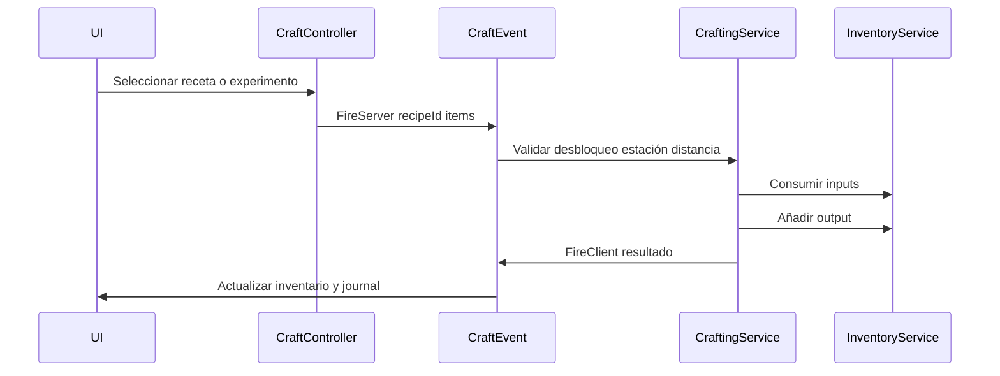

| Paso | Validación servidor |
|------|---------------------|
| 1 | Jugador tiene receta desbloqueada |
| 2 | Estación correcta (mesa, fogata, olla) |
| 3 | Distancia a estación ≤ 12 studs |
| 4 | Inputs presentes en inventario |
| 5 | Espacio en inventario para output |
| 6 | Cooldown de craft respetado (1 s por receta) |

### 4.10 Progresión de crafteo por fase

| Fase | Recetas clave | Sensación |
|------|---------------|-----------|
| **Tutorial** | Chispas, yesca, fogata, vendaje | "Puedo sobrevivir" |
| **Early** | Hacha, cofre, mesa, comida cocinada | "Mi campamento funciona" |
| **Mid** | Arco, antídoto, muros, olla, guiso | "Puedo arriesgar lejos" |
| **Late** | Hierro, trampas, capa impermeable, muelle | "Domino el mundo" |

### 4.11 Interacción con otros sistemas

| Sistema | Relación |
|---------|----------|
| **Supervivencia (Cap. 3)** | Comida/medicina aplican efectos definidos allí |
| **Ayudantes (§2.13)** | Consumen comida del cofre; cocinero usa recetas de fogata |
| **Ojo del explorador (§1.10)** | +25% drop comida en nodos y +25% chance de item `clue` |
| **Kit supervivencia (§1.10)** | 3× ración ≈ `cooked_berry` + 2× `bandage`; no items raros |
| **Mundo (Cap. 5)** | Nodos de recurso alimentan materias primas |
| **Campamento (Cap. 6)** | Blueprints se colocan en parcela; cofre enlazado |

### 4.12 Reglas de implementación (nota para Fase 2)

- Servicios: `CraftingService`, `InventoryService`
- Repositorio: items en `PlayerProfile.inventory` (existente, ampliar metadata)
- Remotes: `CraftItemEvent`, `TransferItemEvent`, `EquipItemEvent`
- Definiciones compartidas: `Shared/Constants/Items.luau`, `Shared/Constants/Recipes.luau`
- El cliente solo envía **intent** (`recipeId`); nunca el resultado del craft

---

## 5. Mundo, biomas y exploración

El mundo es un **mapa compartido** persistente: todos los jugadores coexisten en el mismo lugar, cada uno con su parcela de campamento. Explorar es obligatorio para progresar: recursos exclusivos, pistas, ayudantes y misiones viven fuera de la zona segura.

### 5.1 Principios de diseño

| Principio | Regla |
|-----------|-------|
| **Mapa único compartido** | Un solo terreno; sin instancias privadas de exploración |
| **Zona segura clara** | El área de campamentos tiene fauna pasiva y sin PvP |
| **Biomas con identidad** | Cada bioma aporta recurso único + peligro + pista |
| **Progresión geográfica** | Biomas lejanos requieren preparación (equipo, campamento) |
| **Nodos regenerables** | Los recursos respawnean; nadie agota el mapa para siempre |
| **Exploración recompensada** | Primera visita a zona = XP + posible pista |

### 5.2 Layout del mapa

**Tamaño objetivo:** ~1800 × 1800 studs (compacto para Roblox; recorrido a pie ~3–5 min entre biomas extremos).

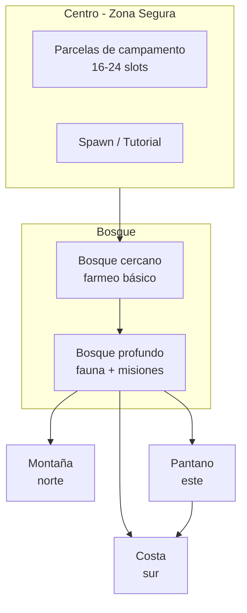

#### Zonas del mapa

| Zona | ID | Ubicación | Función |
|------|-----|-----------|---------|
| **Hub de campamentos** | `camp_hub` | Centro | Parcelas, tutorial, NPC guía |
| **Bosque cercano** | `forest_near` | Anillo alrededor del hub | Recursos básicos; bajo peligro |
| **Bosque profundo** | `forest_deep` | Exterior del bosque | Fauna activa; misiones early/mid |
| **Montaña** | `mountain` | Norte | Frío, minerales, osos |
| **Pantano** | `swamp` | Este | Hierbas raras, serpientes, pistas medicina |
| **Costa** | `coast` | Sur | Pesca, sal, tormentas, pescador |
| **Caminos** | `roads` | Conectan zonas | NPC viajero; menor peligro |

#### Zona segura vs peligrosa

| Zona | Segura | Fauna agresiva | PvP / Raid |
|------|--------|----------------|------------|
| `camp_hub` | ✅ Total | ❌ | ❌ (escudo de zona) |
| `forest_near` | ✅ Parcial | Solo de noche, leve | ❌ |
| `forest_deep` | ❌ | ✅ | ❌ |
| `mountain` | ❌ | ✅ | ❌ |
| `swamp` | ❌ | ✅ (veneno) | ❌ |
| `coast` | ❌ | ✅ | ❌ |
| Parcela del jugador | ✅ Defensible | Entra si no hay muro | ✅ Raid mid game+ |

**Regla:** el PvP entre jugadores ocurre **solo en parcelas** bajo reglas de raid (Cap. 7), no en mundo abierto.

### 5.3 Desbloqueo de biomas

El jugador puede **caminar** a cualquier bioma desde el inicio, pero sin preparación morirá. El **mapa UI** muestra biomas como "Recomendado nivel X" y requisitos.

| Bioma | Requisito suave (aviso UI) | Requisito duro (puertas/naturaleza) |
|-------|----------------------------|-------------------------------------|
| **Bosque cercano** | Ninguno | Ninguno |
| **Bosque profundo** | Tutorial completado | Ninguno |
| **Montaña** | Campamento nv. 1 + `axe_crude` | Paso estrecho; frío extremo sin abrigo |
| **Pantano** | Campamento nv. 2 + 3× `bandage` en inventario | Barro ralentiza; visibilidad baja |
| **Costa** | Misión "Camino al mar" o explorar borde pantano | Requiere `rope` para bajar acantilado sur |

**Requisito duro:** no es un muro invisible; es diseño del terreno + clima que castiga ir unprepared.

### 5.4 Ciclo día / noche

| Parámetro | Valor |
|-----------|-------|
| **Duración ciclo completo** | 20 min reales |
| **Día** | 14 min |
| **Noche** | 6 min |
| **Transición** | 30 s amanecer / atardecer |

#### Efectos globales

| Aspecto | Día | Noche |
|---------|-----|-------|
| **Visibilidad** | Normal | −30% en bosque/pantano; linterna/fogata ayudan |
| **Temperatura ambiente** | Valores base (Cap. 3) | −15 a −20 vs día en bosque/montaña |
| **Fauna agresiva** | Patrulla reducida | +50% spawn rate en `forest_deep`+ |
| **Nodos de recurso** | Normal | Bayas y hongos +25% en bosque (compensa frío) |
| **Ayudantes en parcela** | Normal | Necesitan fogata activa si están fuera de refugio |

**Feedback:** cielo, iluminación ambiental, sonido de grillos/lobos, icono reloj en HUD.

### 5.5 Clima y eventos dinámicos

#### Clima base por bioma

| Bioma | Clima habitual | Efecto especial |
|-------|----------------|-----------------|
| Bosque | Despejado / nublado | Estándar |
| Montaña | Viento / nevada ligera | Temp ambiente −5 extra |
| Pantano | Niebla | Visibilidad −20% |
| Costa | Brisa / **tormenta** | `wet` frecuente |

#### Eventos dinámicos (servidor)

| Evento | ID | Frecuencia | Zona | Efecto |
|--------|-----|-----------|------|--------|
| **Tormenta** | `storm` | ~1 cada 25 min global | Costa + bosque abierto | `wet`; fogatas expuestas se apagan (50% chance) |
| **Manada de lobos** | `wolf_pack` | ~1 cada 35 min | `forest_deep` | 3–4 lobos patrullan ruta 2 min |
| **NPC viajero** | `traveler` | ~1 cada 30 min | `roads` | Comercio temporal / mini-misión |
| **Manada ciervos** | `deer_herd` | ~1 cada 40 min | `forest_near` | Fuente de comida extra (bayas/carne futura) |
| **Avalancha menor** | `avalanche` | ~1 cada 45 min | `mountain` | Daño en zona marcada; minerales expuestos 5 min |

**Regla:** máximo **1 evento mayor activo** por jugador afectado a la vez; notificación UI + marcador en mapa.

### 5.6 Sistema de nodos de recurso

#### Tipos de nodo

| Tipo | Interacción | Ejemplo items |
|------|-------------|---------------|
| **Recolectar** | Pulsar / mantener 1.5 s | Bayas, hierbas, piedras sueltas |
| **Talar** | Requiere hacha equipada | `wood`, `stick` |
| **Minar** | Requiere pico equipado | `stone`, `iron_ore`, `flint` |
| **Pescar** | Mini-juego o espera 3 s en agua | `fish_raw` |
| **Agua** | Recolectar con contenedor | `water_dirty` |
| **Pista** | Interactuar una vez | Items `clue_*` |

#### Reglas de respawn

| Rareza del nodo | Cantidad por harvest | Respawn (global) | Respawn (mismo jugador cooldown) |
|-----------------|----------------------|------------------|----------------------------------|
| Común | 2–4 items | 3 min | 1 min anti-spam |
| Medio | 1–2 items | 6 min | 2 min |
| Raro | 1 item | 12 min | 5 min |
| Pista | 1 (una vez por jugador) | — | Permanente en perfil |

**Modelo multijugador:** nodos son **compartidos**; el primer jugador que recolecta agota el nodo hasta respawn global. Evita duplicación infinita con validación servidor.

#### Densidad por zona (nodos activos aprox.)

| Zona | Comunes | Medios | Raros |
|------|---------|--------|-------|
| `forest_near` | 40 | 8 | 0 |
| `forest_deep` | 25 | 15 | 2 |
| `mountain` | 10 | 20 | 8 |
| `swamp` | 15 | 18 | 6 |
| `coast` | 20 | 12 | 3 |

### 5.7 Bioma: Bosque

**Rol:** tutorial, early game, primer ayudante (leñador/cocinero).

| Aspecto | Detalle |
|---------|---------|
| **Clima** | Día templado (45); noche fría (25) |
| **Recursos exclusivos** | `berry`, `tinder`, `leaf`, abundante `wood` |
| **Fauna** | Lobo, serpiente (raro en cercano) |
| **Peligros** | Manadas nocturnas, serpiente en matorral |
| **Pistas** | `clue_hermit_scroll` (ermitaño, bosque profundo) |
| **Ayudantes** | Leñador (misión "El leñador perdido"), Cocinero (misión cadena ermitaño) |
| **Misiones clave** | Tutorial, cadena ermitaño, primer contacto con craft |

#### Tabla de nodos — Bosque

| Nodo | Zona | Output | Herramienta |
|------|------|--------|-------------|
| Arbusto de bayas | near + deep | 2–3× `berry` | — |
| Árbol pequeño | near | 3× `wood`, 1× `stick` | `axe_*` |
| Árbol grande | deep | 5× `wood`, 2× `stick` | `axe_*` |
| Piedra suelta | near | 2× `stone` | — |
| Afloramiento | deep | 1× `flint`, 2× `stone` | `pick_*` opcional |
| Matorral | deep | 1× `herb_common` (50%) | — |

### 5.8 Bioma: Montaña

**Rol:** mid game; herramientas tier 2; frío extremo; guardián y minero.

| Aspecto | Detalle |
|---------|---------|
| **Clima** | Día frío (30); noche muy frío (10); viento |
| **Recursos exclusivos** | `iron_ore`, `flint` abundante, `stone` |
| **Fauna** | Oso, águila (ambiental, no ataca v0.1) |
| **Peligros** | Frío severo sin abrigo; osos; avalancha evento |
| **Pistas** | `clue_smithing_stone` (cueva norte) |
| **Ayudantes** | Guardián (misión "La vigía"), Minero (explorar cueva) |
| **Requisito recomendado** | `coat_basic`, `axe_crude`, comida cocinada |

#### Tabla de nodos — Montaña

| Nodo | Output | Notas |
|------|--------|-------|
| Veta de hierro | 1× `iron_ore` | Requiere `pick_*` |
| Roca grande | 4× `stone` | Pico acelera |
| Cueva (interior) | `flint`, `iron_ore` | Poca luz; linterna futura |
| Arbusto rígido | 1× `fiber` | Escaso |

### 5.9 Bioma: Pantano

**Rol:** medicina avanzada; veneno; herbalista; antídoto.

| Aspecto | Detalle |
|---------|---------|
| **Clima** | Húmedo (40); niebla permanente leve |
| **Recursos exclusivos** | `herb_red`, `mud`, `herb_common` denso |
| **Fauna** | Serpiente venenosa (alta freq.), cocodrilo (v0.2 opcional) |
| **Peligros** | Veneno; barro (−20% velocidad movimiento) |
| **Pistas** | `clue_botanist_note` (cabaña abandonada este) |
| **Ayudantes** | Herbalista (curar NPC herido en cabaña) |
| **Requisito recomendado** | `bandage`, antídoto o `herb_red` farmeado con cuidado |

#### Tabla de nodos — Pantano

| Nodo | Output | Notas |
|------|--------|-------|
| Hierba roja | 1× `herb_red` | Raro; respawn 12 min |
| Lodo | 2× `mud` | Craft futuro |
| Hierba común | 2× `herb_common` | Frecuente |
| Agua estancada | 1× `water_dirty` | 15% enfermedad directa |

### 5.10 Bioma: Costa

**Rol:** late early / mid; pesca; sal; pescador; capa impermeable.

| Aspecto | Detalle |
|---------|---------|
| **Clima** | Cálido día (55); tormentas frecuentes |
| **Recursos exclusivos** | `fish_raw`, `salt`, agua |
| **Fauna** | Cangrejo, gaviota (ambiental) |
| **Peligros** | `wet` + tormenta; poca sombra |
| **Pistas** | `clue_sailor_journal` (naufragio sur) |
| **Ayudantes** | Pescador (curar y reclutar en naufragio) |
| **Requisito recomendado** | Misión camino al mar, `rope`, `bow_crude` vs cangrejos |

#### Tabla de nodos — Costa

| Nodo | Output | Notas |
|------|--------|-------|
| Punto de pesca | 1× `fish_raw` | Mini-juego o 3 s cast |
| Formación de sal | 2× `salt` | Respawn 6 min |
| Orilla | 1× `water_dirty` | — |
| Naufragio (POI) | `clue_sailor_journal`, pescador NPC | Una vez por jugador |

### 5.11 Fauna — Comportamiento IA

Estados de la máquina de estados (servidor):

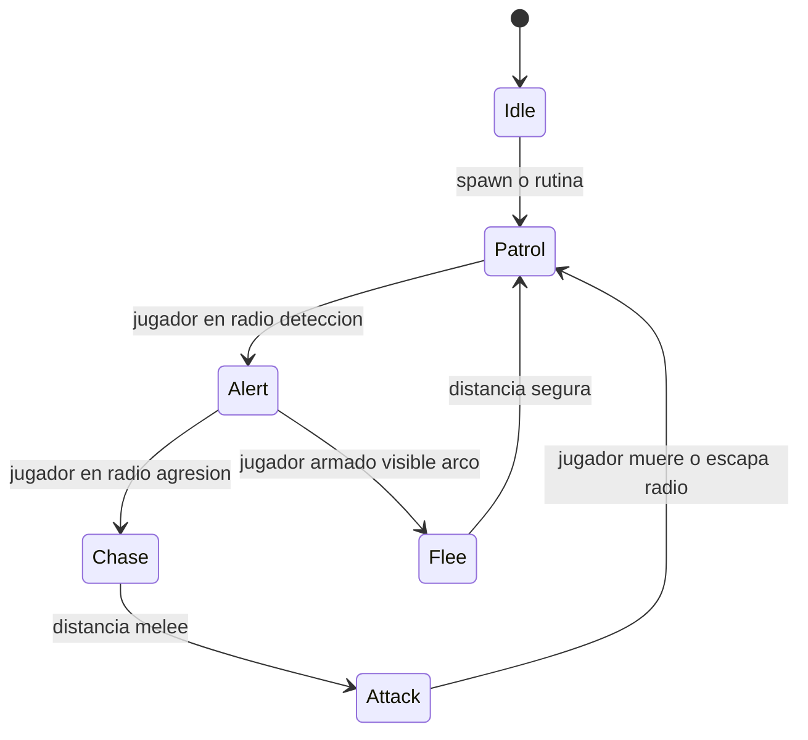

#### Parámetros por especie (v0.1)

| Especie | Bioma | HP | Daño | Velocidad | Detección | Agresión | Drop |
|---------|-------|-----|------|-----------|-----------|----------|------|
| **Lobo** | Bosque | 40 | −15 HP + 60% `bleeding` | Media | 40 studs | Alta de noche | 1× `fiber` (50%) |
| **Serpiente** | Bosque/Pantano | 15 | −8 HP + 100% `poison` | Baja | 25 studs | Emboscada | 1× `herb_common` (30%) |
| **Oso** | Montaña | 80 | −25 HP + 100% `bleeding` | Media | 35 studs | Media | 2× `fiber`, 1× `fish_raw` (raro) |
| **Cangrejo** | Costa | 20 | −5 HP | Baja | 15 studs | Solo si provocado | — |

**Reglas IA:**
- Máx. **8 criaturas activas** por jugador en radio 100 studs (performance).
- Fauna **no entra** en `camp_hub`; en parcelas sin muro puede entrar lobo (evento defensa).
- Los animales **no farmean** jugadores en zona segura `forest_near` de día (solo noche).

### 5.12 Ayudantes encontrables en el mundo

| Ayudante | Bioma | Cómo encontrarlo | Condición de reclutamiento |
|----------|-------|------------------|----------------------------|
| **Leñador** | Bosque profundo | Misión "El leñador perdido" | Escoltarlo a parcela (lobos) |
| **Cocinero** | Bosque | Tras cadena ermitaño | Dar 5× comida cocinada |
| **Herbalista** | Pantano | Cabaña abandonada | Curarlo (`bandage` + `herb_common`) |
| **Guardián** | Montaña | Torre de vigilancia | Completar misión defensa oleada lobos |
| **Minero** | Montaña | Cueva | Dar `pick_crude` + 10× `stone` |
| **Pescador** | Costa | Naufragio | Curarlo + dar `cooked_fish` ×3 |

**Reemplazo tras muerte:** repetir misión equivalente en bioma de origen (cooldown 24 h real por tipo).

### 5.13 Exploración — Mapa y progreso

| Mecánica | Detalle |
|----------|---------|
| **Niebla de mapa** | Zonas no visitadas ocultas; se revela al entrar |
| **Marcadores** | Misiones, pistas, parcela propia, cofre, ayudantes |
| **Primer descubrimiento** | +15 XP al entrar en bioma por primera vez |
| **POIs permanentes** | Ermitaño, cabaña pantano, cueva, naufragio, torre montaña |
| **Ojo del explorador** | +25% chance de nodo raro y drop de pista (Cap. 4) |

#### Puntos de interés (POI)

| POI | Bioma | Contenido |
|-----|-------|-----------|
| Ermitaño del roble | Bosque profundo | Misiones, `clue_hermit_scroll` |
| Cabaña del botánico | Pantano | `clue_botanist_note`, herbalista |
| Cueva del eco | Montaña | Minerales, `clue_smithing_stone`, minero |
| Torre del guardián | Montaña | Misión guardián |
| Naufragio del Alba | Costa | Pescador, `clue_sailor_journal` |
| Mercado del viajero | Caminos (evento) | Comercio temporal |

### 5.14 Progresión de exploración por fase

| Fase | Zonas habituales | Objetivo |
|------|------------------|----------|
| **Tutorial** | `camp_hub`, `forest_near` | Aprender movimiento y recolección |
| **Early** | `forest_deep` | Madera, leñador, ermitaño |
| **Mid** | Montaña + Pantano | Hierro, antídoto, herbalista, guardián |
| **Late** | Costa + rotación global | Pesca, sal, pescador, recursos para clan |

### 5.15 Interacción con otros sistemas

| Sistema | Relación |
|---------|----------|
| **Supervivencia (Cap. 3)** | Clima del bioma alimenta temperatura ambiente |
| **Crafting (Cap. 4)** | Nodos producen materias primas de la tabla de items |
| **Ayudantes (§2.13)** | Reclutamiento ocurre en POIs de este capítulo |
| **Campamento (Cap. 6)** | Parcelas en `camp_hub`; defensa contra fauna/raid |
| **Misiones (Cap. 8)** | Ancladas a POIs y eventos dinámicos |

### 5.16 Reglas de implementación (nota para Fase 2)

- Servicios: `ResourceService`, `AnimalService`, `DayNightService`, `WeatherService`
- Mundo: construido en Studio; nodos como `CollectionService` tags (`ResourceNode`, `BiomeZone`)
- Zonas de bioma: `Region3` o partes con atributo `BiomeId`
- Validación: distancia al nodo, herramienta equipada, cooldown, nodo no agotado
- Fauna: modelos en `ServerStorage`; pool de spawn por bioma

---

## 6. Campamento y construcción

El campamento es el **hogar persistente** del jugador (o clan) en el hub central. Colocar estructuras, gestionar ayudantes y subir de nivel desbloquea crafteo, defensa y acceso al raideo.

### 6.1 Principios de diseño

| Principio | Regla |
|-----------|-------|
| **Parcela fija** | Asignada al primer join; no se mueve salvo disolver clan |
| **Límites visibles** | Borde de parcela siempre visible (postes, humo, UI) |
| **Construcción con blueprints** | Craftear blueprint → colocar en modo construcción |
| **Progresión por nivel** | Nivel de campamento desbloquea estructuras y caps |
| **Defensa preparatoria** | Muros y trampas mitigan fauna y raids; no son invencibles |
| **Ayudantes anclados** | Trabajan en radio de la parcela; estación asignable |

### 6.2 Sistema de parcelas

#### Asignación

| Evento | Comportamiento |
|--------|----------------|
| **Primer join** | Servidor asigna parcela libre más cercana al spawn |
| **Parcelas agotadas** | Cola de espera o servidor recomienda otro (futuro: expansión hub) |
| **Clan creado** | Líder elige parcela libre **grande** o fusiona parcelas adyacentes de miembros |
| **Clan disuelto** | Parcela clan se libera; miembros recuperan parcela personal pequeña |

**Capacidad hub v0.1:** 24 parcelas personales + 4 parcelas clan (28 slots totales en mapa inicial).

#### Dimensiones

| Tipo | Tamaño (studs) | Área | Ayudantes máx. |
|------|----------------|------|----------------|
| **Personal (solo)** | 48 × 48 | ~2 304 | 2 |
| **Clan** | 96 × 96 | ~9 216 | 4 |

**Altura máxima de construcción:** 16 studs sobre terreno de la parcela.

#### Límites visuales

- Postes en las 4 esquinas con partículas suaves del color del jugador/clan.
- Al entrar en modo construcción: grid 4×4 studs en suelo.
- Intentar colocar fuera de la parcela → feedback rojo + sonido de error.
- Visitantes pueden **entrar** a parcela ajena (social); no pueden construir ni abrir cofre ajeno.

#### Persistencia

Datos guardados en perfil (`camp.plotId`, `camp.level`, `camp.structures[]`):

```luau
-- Estructura persistida (referencia Fase 2)
{
  structureId: string,
  blueprintId: string,  -- ej. "bp_wall_wood"
  position: Vector3,
  rotation: number,
  hp: number?,
  linkedChestId: string?,  -- ayudante auto-alimentar
}
```

### 6.3 Nivel de campamento

El nivel mide **madurez de la base**. Sube automáticamente al cumplir requisitos; no se degrada.

| Nivel | Nombre | Requisitos (todas) | Desbloquea |
|-------|--------|-------------------|------------|
| **0** | Claro vacío | — | Solo tutorial |
| **1** | Campamento básico | `bp_campfire` + `bp_chest` + `bp_craft_table` colocados | Recetas `starter`; misiones bosque |
| **2** | Campamento defendido | Nv.1 + `bp_wall_wood` ×4 + `bp_door_wood` ×1 + `bp_shelter` ×1 | Muros, refugio; bioma pantano recomendado |
| **3** | Campamento fortificado | Nv.2 + `bp_pot` + `bp_trap_spike` ×2 + campamento estable 24 h | **Raideo** (Cap. 7); `pick_iron`; trampas |
| **4** | Campamento veterano | Nv.3 + `bp_alarm` + 2 ayudantes vivos simultáneos + 7 días jugados | Máx. estructuras; prestige cosmético |

**Campamento estable 24 h:** al menos 1 fogata encendida y cofre con ≥10 items acumulados en las últimas 24 h de tiempo de juego.

#### Límite de estructuras por nivel

| Nivel | Máx. estructuras colocadas |
|-------|----------------------------|
| 0–1 | 10 |
| 2 | 18 |
| 3 | 28 |
| 4 | 36 |

*(Fogata, cofre y mesa cuentan en el total.)*

### 6.4 Catálogo de estructuras

| Blueprint | Nombre | Tamaño grid | HP | Función |
|-----------|--------|-------------|-----|---------|
| `bp_campfire` | Fogata | 2×2 | — | Calor, cocina, secado; estación `campfire` |
| `bp_craft_table` | Mesa de craft | 3×2 | 50 | Craft + experimentación |
| `bp_chest` | Cofre | 2×2 | 80 | Almacén 24 slots; objetivo de raid |
| `bp_wall_wood` | Muro madera | 1×4 (segmento) | 100 | Bloquea fauna; reduce acceso raid |
| `bp_door_wood` | Puerta | 1×4 | 80 | Paso; cerrable por dueño/clan |
| `bp_shelter` | Refugio | 4×4 | 120 | Mitiga frío/tormenta; ayudantes refugio |
| `bp_pot` | Olla | 1×1 (sobre fogata) | — | Estación `pot` |
| `bp_dock` | Muelle | 4×2 | 60 | Pescador; acceso agua |
| `bp_trap_spike` | Trampa pinchos | 2×2 | 40 | Daño fauna/raider; 3 usos |
| `bp_alarm` | Campana alarma | 1×1 | 30 | Alerta raid + ayudante guardián |

#### Reglas por estructura

| Estructura | Reglas especiales |
|------------|-------------------|
| **Fogata** | Requiere `wood` cada 15 min para mantenerse; se apaga en tormenta (50%) o al quedarse sin combustible |
| **Cofre** | Solo dueño/clan con permiso; contenido objetivo principal de raids |
| **Puerta** | Estado abierto/cerrado; cerrada reduce velocidad de raid en muro adyacente |
| **Olla** | Solo colocable si hay fogata activa en la misma celda o adyacente |
| **Muelle** | Solo en borde de parcela que toque agua (costa o río hub) |
| **Trampa** | −15 HP al activarse; se destruye tras 3 activaciones |
| **Alarma** | Notifica a dueño online; guardián −20% daño estructuras durante raid |

### 6.5 Modo construcción

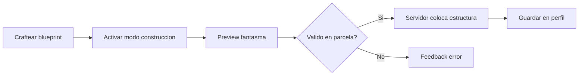

| Paso | Validación servidor |
|------|---------------------|
| Entrar en modo | Tener blueprint en inventario |
| Preview | Cliente muestra fantasma; servidor no confía en posición aún |
| Confirmar | Dentro de parcela; sin solapamiento; nivel campamento suficiente; bajo límite de estructuras |
| Colocar | Consume blueprint; crea instancia con HP inicial |
| Demoler | Solo dueño/clan Líder; devuelve 50% materiales como items comunes (no blueprint) |

**Controles móvil:** botón construir → lista blueprints → arrastrar fantasma → confirmar.  
**Controles PC:** `B` modo build; rotar con `R`; clic confirmar.

### 6.6 Defensa del campamento

#### Contra fauna (PvE)

| Defensa | Efecto |
|---------|--------|
| **Muro cerrado** | Fauna no entra salvo evento especial (lobo nocturno 10% si puerta abierta) |
| **Fogata activa** | −50% probabilidad spawn fauna en parcela |
| **Trampa** | Daño a lobo/serpiente que cruce |
| **Ayudante guardián** | Alerta + reduce daño a otros ayudantes un 30% en evento fauna |

#### Contra raids (PvP — detalle Cap. 7)

| Defensa | Efecto |
|---------|--------|
| **Muros + puerta cerrada** | Raid tarda +60 s en acceder al cofre |
| **Trampas** | −15 HP al raider por trampa |
| **Alarma + guardián** | Dueño recibe notificación; estructuras +20% HP efectivo |
| **Escudo de campamento (§1.10)** | Bloquea o reduce botín (no destruye muros) |

**Regla:** los raids **no destruyen permanentemente** el campamento; dañan estructuras (HP baja) y roban % del cofre. El dueño **repara** con materiales (`wood`, `stone`).

#### Reparación

| Estructura dañada | Coste reparación (100% HP) |
|-------------------|----------------------------|
| Muro | 2× `wood` |
| Puerta | 2× `wood` + 1× `rope` |
| Cofre | 3× `wood` |
| Refugio | 4× `wood` + 2× `fiber` |
| Trampa | No reparable; recraft |

### 6.7 Gestión de ayudantes en campamento

#### Estaciones de trabajo

| Ayudante | Punto de anclaje | Radio de trabajo |
|----------|------------------|------------------|
| Leñador | Árbol marcador o borde parcela | 20 studs |
| Cocinero | Fogata | 8 studs |
| Pescador | Muelle o borde agua | 15 studs |
| Herbalista | Mesa de craft | 12 studs |
| Guardián | Alarma o puerta principal | Toda la parcela (alerta) |
| Minero | Punto de piedra marcado | 15 studs |

El jugador **asigna estación** interactuando con el ayudante → seleccionar punto válido en parcela.

#### Auto-alimentación

| Config | Comportamiento |
|--------|----------------|
| **Cofre vinculado** | El jugador elige 1 cofre; ayudante consume comida automática (prioridad: `cooked_*` > `berry`) |
| **Manual** | Entregar item de comida al ayudante |
| **Alerta** | Hambre ≤ 20 → notificación; hambre 0 → `weak` |

#### Comando refugio

| Comando | Efecto |
|---------|--------|
| **Refugio** | Ayudante deja de trabajar; va a fogata/refugio; −80% probabilidad daño en raid/tormenta |
| **Trabajar** | Vuelve a estación asignada |
| **Seguir** | *(Solo en expedición futura v0.2)* — no v0.1 |

**Noche:** si hay ayudantes fuera de refugio y fogata apagada, hambre −3/min se mantiene y riesgo de frío narrativo (sin stat temp en ayudantes).

### 6.8 Campamento de clan

| Aspecto | Regla |
|---------|-------|
| **Parcela** | 96×96; un clan = una parcela |
| **Permisos — Líder** | Construir, demoler, cofre, asignar ayudantes, cerrar puerta |
| **Permisos — Miembro** | Usar mesa/fogata, depositar en cofre, reparar |
| **Permisos — Invitado** | Solo entrar si puerta abierta; sin cofre |
| **Ayudantes** | Máx. 4; pool compartido; Líder asigna estaciones |
| **Cofre clan** | 36 slots; raid roba de aquí (Cap. 7) |
| **Fusión** | 2+ miembros pueden donar parcelas pequeñas adyacentes → parcela clan (irreversible) |

### 6.9 Flujo de progresión del campamento

| Día aprox. | Hito de campamento | Sensación jugador |
|------------|-------------------|-------------------|
| 1 | Nv. 1 — fogata, cofre, mesa | "Tengo base" |
| 2–3 | Nv. 2 — muros, refugio | "Estoy protegido" |
| 5–10 | Nv. 3 — olla, trampas, raid desbloqueado | "Debo defender lo mío" |
| 15+ | Nv. 4 — alarma, equipo ayudantes | "Campamento veterano" |

### 6.10 Interacción con otros sistemas

| Sistema | Relación |
|---------|----------|
| **Crafting (Cap. 4)** | Blueprints crafteados → colocados aquí |
| **Supervivencia (Cap. 3)** | Fogata/refugio mitigan temperatura; respawn en parcela |
| **Mundo (Cap. 5)** | Parcelas en `camp_hub`; muelle requiere agua |
| **Ayudantes (§2.13)** | Estaciones, auto-feed, refugio |
| **Raideo (Cap. 7)** | Nv. 3+; cofre objetivo; defensa estructural |
| **Monetización (§1.10)** | Slots extra cofre; decoración parcela; escudo raid |

### 6.11 Reglas de implementación (nota para Fase 2)

- Servicio: `CampService` — parcelas, colocación, nivel, reparación
- Repositorio: `camp` en `PlayerProfile` / `ClanProfile`
- Remotes: `PlaceStructureEvent`, `DemolishStructureEvent`, `RepairStructureEvent`, `AssignHelperEvent`, `LinkChestEvent`
- Controller: `BuildingController` — preview fantasma; intent only
- Colisiones: grid servidor; anti-solapamiento por AABB en parcela
- Límite 36 estructuras × 100 jugadores → optimizar modelos low-poly instanciados

---

## 7. Multijugador, clanes y raideo

El multijugador añade **cooperación** (clanes, comercio) y **tensión controlada** (raideo). El diseño prioriza **anti-frustración**: escudos para novatos y offline, límites de botín y ventanas de ataque acotadas.

### 7.1 Principios de diseño

| Principio | Regla |
|-----------|-------|
| **PvP acotado** | Raideo solo en parcelas; nunca PvP libre en mundo abierto |
| **Mid game gate** | Raideo desbloqueado tras campamento maduro (nv. 3) |
| **Anti-grief** | Límites de botín, cooldowns, escudos offline/novato |
| **Clan opcional** | 100% del juego viable en solo |
| **Servidor autoritativo** | Comercio, raid y permisos validados en servidor |
| **Sin pay-to-win PvP** | Boosts de pago protegen defensa; no venden daño extra en raid |

### 7.2 Interacción entre jugadores (no raid)

| Acción | Dónde | Requisito | Descripción |
|--------|-------|-----------|-------------|
| **Visitar parcela** | Cualquier campamento | Puerta abierta o invitación | Caminar por base ajena; social |
| **Chat** | Global / local | Chat Roblox estándar | Moderación Roblox |
| **Emotes** | Cualquier lugar | Desbloqueados | Cosméticos; sin gameplay |
| **Comercio directo** | `camp_hub`, `roads` | Ambos ≥ campamento nv. 1 | Intercambio items validado |
| **Ver campamento en mapa** | UI mapa | Haber visitado o marcador público | No revela contenido del cofre |

**Regla:** no se puede abrir cofre, craftear ni demoler en parcela ajena sin raid activo.

### 7.3 Comercio entre jugadores

#### Flujo

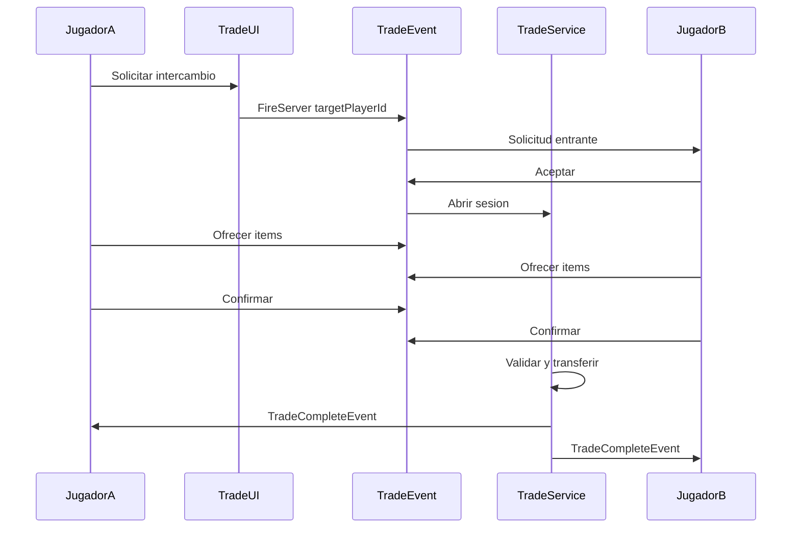

| Regla | Detalle |
|-------|---------|
| **Zona segura** | Solo en `camp_hub` y `roads` (no durante raid ni combate fauna) |
| **Distancia** | ≤ 20 studs entre jugadores |
| **Slots por lado** | Máx. 6 items por jugador por trade |
| **Items bloqueados** | Pistas `clue_*`, blueprints colocados, ayudantes |
| **Cooldown** | 5 s entre trades completados (anti-dupe lag) |
| **Impuesto** | Ninguno v0.1 |

**Uso típico:** intercambiar `herb_red` (pantano) por `iron_ore` (montaña) entre miembros de clan o aliados.

### 7.4 Clanes

#### Datos del clan

| Campo | Descripción |
|-------|-------------|
| `clanId` | UUID único |
| `name` | 3–20 caracteres; filtro Roblox |
| `leaderId` | UserId del líder |
| `members` | Lista UserId + rol |
| `plotId` | Parcela 96×96 en hub |
| `chest` | Inventario compartido (36 slots) |
| `helpers` | Máx. 4 ayudantes activos |
| `createdAt` | Timestamp |

#### Creación y membresía

| Acción | Regla |
|--------|-------|
| **Crear clan** | Campamento nv. 2+; coste 500 moneda in-game (Cap. 9); parcela clan libre |
| **Invitar** | Solo Líder; máx. 4 miembros totales v0.1 (incl. líder) |
| **Unirse** | Aceptar invitación; abandona parcela personal (guardada en perfil suspendida) |
| **Abandonar** | Recupera parcela personal; clan sigue si quedan miembros |
| **Disolver** | Solo Líder; libera parcela; todos recuperan parcela personal |
| **Expulsar** | Solo Líder; miembro recupera parcela personal |

#### Roles y permisos

| Permiso | Líder | Miembro |
|---------|-------|---------|
| Construir / demoler | ✅ | ❌ |
| Cofre — retirar | ✅ | ✅ |
| Cofre — depositar | ✅ | ✅ |
| Asignar ayudantes | ✅ | ❌ |
| Cerrar/abrir puerta | ✅ | ✅ |
| Reparar estructuras | ✅ | ✅ |
| Iniciar raid (atacar) | ✅ | ✅ |
| Invitar / expulsar | ✅ | ❌ |
| Disolver clan | ✅ | ❌ |

#### Misiones de clan *(detalle Cap. 8)*

Cadena cooperativa: recolectar X recursos entre todos, defender oleada NPC, construir estructura clan. Recompensa: XP clan + cosmético de estandarte.

### 7.5 Raideo — Visión general

El raideo es **robo parcial del cofre**, no destrucción de base. El atacante debe **llegar físicamente** al campamento objetivo y acceder al cofre dentro de una **ventana de raid** limitada.

**Qué NO es el raideo:**
- No es combate PvP obligatorio (aunque el defensor online puede usar arco)
- No elimina estructuras permanentemente
- No mata ayudantes instantáneamente (pueden herirse según Cap. 3)
- No vacía el cofre completo

### 7.6 Desbloqueo del raideo

#### Atacante — requisitos (todos)

| Requisito | Detalle |
|-----------|---------|
| Campamento propio nv. | ≥ 3 |
| Tutorial | Completado |
| Arma crafteada | `bow_crude` equipado al menos una vez, o `axe_crude` |
| Tiempo de juego | ≥ 24 h acumuladas (fin escudo novato como atacante) |
| Cooldown global | No haber raidado en las últimas 2 h |

#### Objetivo — requisitos para ser raideable

| Condición | Raideable |
|-----------|-----------|
| Campamento nv. ≥ 3 | ✅ |
| Escudo novato (< 24 h juego del dueño) | ❌ |
| Escudo de campamento activo (§1.10) | ❌ (o botín −50% si escudo parcial) |
| Mismo clan que atacante | ❌ |
| Ya raideado por ti en últimas 12 h | ❌ |

### 7.7 Ventanas y límites de raid

| Parámetro | Valor |
|-----------|-------|
| **Tiempo de raid activo** | 8 min por intento |
| **Presupuesto diario atacante** | 30 min total de raid activo / día |
| **Intentos fallidos** | Cuentan para presupuesto |
| **Cooldown mismo objetivo** | 12 h entre raids al mismo campamento |
| **Raids recibidos por defensor** | Máx. 2 / día |
| **Horario opcional** | Defensor puede activar "Horario de paz" 8 h (1×/semana) — no recibe raids |

### 7.8 Escudos anti-frustración

| Escudo | Condición | Efecto |
|--------|-----------|--------|
| **Novato** | Dueño con < 24 h tiempo de juego | No puede ser raideado |
| **Offline** | Dueño desconectado | Botín máx. **10%** del cofre (por slots, no por valor) |
| **Online** | Dueño conectado | Botín máx. **25%**; notificación inmediata |
| **Escudo pago (§1.10)** | Activo | Bloquea 1 raid completo **o** reduce botín 50% si el atacante ya entró |
| **Horario de paz** | Activado por defensor | Inmune durante 8 h (cooldown 7 días) |

**Cálculo de botín:** porcentaje aplicado sobre **slots ocupados** del cofre, redondeo hacia abajo, mínimo 0, máximo según tabla:

| Situación defensor | % máx. cofre robable | Slots máx. llevados por atacante |
|--------------------|----------------------|----------------------------------|
| Offline | 10% | 6 |
| Online | 25% | 8 |
| Online + alarma + guardián | 20% | 8 |
| Escudo pago parcial | 50% de reducción sobre lo anterior | — |

**Ejemplo:** cofre con 20 slots llenos, defensor offline → máx. 2 slots robables (10%).

### 7.9 Flujo de un raid

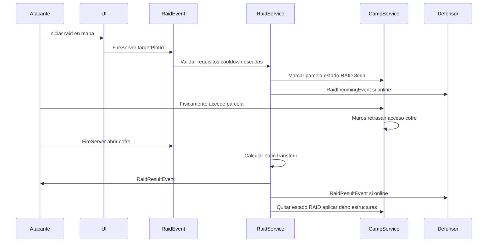

#### Fases del raid (8 min)

| Fase | Tiempo | Qué ocurre |
|------|--------|------------|
| **1. Alerta** | 0:00 | Parcela entra en estado `RAID`; defensor notificado; alarma suena |
| **2. Breach** | 0:00–? | Atacante supera muros/puerta (tiempo depende defensas Cap. 6) |
| **3. Loot** | Al abrir cofre | Transferencia botín según §7.8; atacante debe estar ≤ 8 studs del cofre |
| **4. Escape** | Post-loot | Atacante puede quedarse pero ya no obtiene más loot |
| **5. Fin** | 8:00 | Estado `RAID` termina; estructuras reciben daño parcial reparable |

#### Acciones permitidas al atacante durante raid

| Permitido | Prohibido |
|-----------|-----------|
| Entrar a parcela objetivo | Demoler estructuras |
| Usar arco vs defensor online | Matar ayudantes directamente (solo daño indirecto por evento) |
| Activar trampas (recibe daño) | Robar inventario personal del defensor |
| Abrir cofre (con retraso si puerta cerrada) | Robar más del % máximo |
| Salir cuando quiera | Volver a intentar mismo cofre tras éxito (cooldown 12 h) |

**Retraso puerta cerrada:** 45 s base − 10 s por trampa activada en atacante − 15 s si muro roto (min 15 s).

### 7.10 Defensa durante raid

| Mecánica | Efecto |
|----------|--------|
| **Defensor online presente** | Puede usar arco; presencia reduce botín a 25% |
| **Puerta cerrada** | Retraso acceso cofre |
| **Trampas** | −15 HP al atacante; no mata sola |
| **Guardián + alarma** | Botín −5% extra; notificación más rápida |
| **Ayudantes en refugio** | −80% probabilidad herida (Cap. 6) |
| **Escudo pago** | Bloqueo o −50% botín |

**Muerte del atacante en raid:** respawn estándar (Cap. 3); raid continúa hasta 8 min o loot obtenido.

**Muerte del defensor:** raid continúa; botín usa regla **online** (estaba conectado).

### 7.11 Daño a estructuras post-raid

Tras cada raid completado (con o sin loot):

| Estructura | Daño aplicado |
|------------|---------------|
| Puerta | −30 HP |
| Muro (random 2 segmentos) | −20 HP c/u |
| Trampa activada | Destruida |
| Cofre | −10 HP (no pierde items extra) |
| Fogata | Apagada (requiere reencender) |

Reparable con materiales (Cap. 6). **Nunca** se elimina estructura del perfil por raid solo por daño — solo si HP → 0 y no reparada antes de otro evento (regenera a 1 HP mínimo en login).

### 7.12 Reputación y estadísticas (opcional v0.1)

| Stat | Visible | Uso |
|------|---------|-----|
| `raidsSucceeded` | Perfil | Logro / cosmético |
| `raidsDefended` | Perfil | Logro |
| `lootStolen` | Privado | Balance interno |
| **Racha raid** | — | Sin bonus gameplay (evitar snowball) |

Sin ventaja mecánica por kills o raids acumulados.

### 7.13 Reglas anti-abuso

| Abuso | Prevención |
|-------|------------|
| Spam raid a novatos | Escudo 24 h |
| Farm offline indefinido | 10% máx.; 2 raids recibidos/día |
| Clan alt para duplicar | 1 parcela por cuenta; trade cooldown |
| Pay-to-win raid | No se vende daño ni botín extra |
| Acampar parcela enemiga | Estado raid 8 min; luego expulsión suave del borde |
| Dupe en trade | Doble confirmación; servidor atómico |

### 7.14 Interacción con otros sistemas

| Sistema | Relación |
|---------|----------|
| **Campamento (Cap. 6)** | Nv. 3 desbloquea raid; defensas afectan tiempos |
| **Supervivencia (Cap. 3)** | Daño atacante/defensor; ayudantes heridos |
| **Inventario (Cap. 4)** | Botín desde cofre; trade entre jugadores |
| **Monetización (§1.10)** | Escudo campamento; sin ventaja atacante |
| **Misiones (Cap. 8)** | Misiones clan; tutorial desbloquea raid |
| **Ayudantes (§2.13)** | Pueden resultar heridos; no reviven si mueren por raid |

### 7.15 Reglas de implementación (nota para Fase 2)

- Servicios: `ClanService`, `RaidService`, `TradeService`
- Repositorio: `ClanRepository`; `PlayerProfile.clanId`, `PlayerProfile.raidStats`
- Remotes: `CreateClanEvent`, `TradeRequestEvent`, `TradeConfirmEvent`, `StartRaidEvent`, `OpenRaidChestEvent`
- Estado raid en memoria servidor por `plotId`; persistir log en perfil
- Notificaciones: `RaidIncomingEvent`, `RaidResultEvent`

---

## 8. Progresión, tutorial y misiones

La progresión guía al jugador desde el primer minuto hasta el endgame. Combina **tutorial obligatorio**, **cadena de misiones**, **nivel de jugador**, **nivel de campamento** (Cap. 6) y **desbloqueos por contenido**.

### 8.1 Principios de diseño

| Principio | Regla |
|-----------|-------|
| **Siempre un objetivo** | ≥1 misión principal activa hasta completar cadena mid game |
| **Tutorial sin muerte** | Primeros 5 min invulnerables |
| **Recompensas útiles** | XP + items que enseñan mecánicas, no relleno |
| **Pistas integradas** | Misiones ambientales desbloquean recetas (Cap. 4) |
| **Dos ejes de progreso** | **Nivel jugador** (XP) y **Nivel campamento** (estructuras) |
| **Micro-logros frecuentes** | Cada 5–10 min algo se desbloquea o completa |

### 8.2 Ejes de progresión

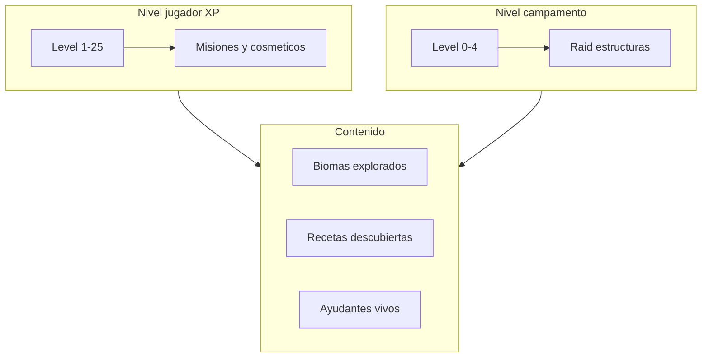

| Eje | Fuente | Desbloquea |
|-----|--------|------------|
| **Nivel jugador** | XP (misiones, exploración, dailies) | Misiones, slots journal, cosméticos tier |
| **Nivel campamento** | Estructuras colocadas (Cap. 6) | Raid, muros, trampas |
| **Recetas** | Tutorial, pistas, experimentos | Craft avanzado |
| **Biomas** | Exploración física | Recursos, POIs, ayudantes |
| **Logros** | Hitos acumulados | Cosméticos; sin power |

### 8.3 Sistema de XP y nivel de jugador

#### Fuentes de XP

| Acción | XP |
|--------|-----|
| Paso tutorial completado | 10–25 c/u |
| Misión principal | 50–150 |
| Misión secundaria | 30–80 |
| Misión diaria | 40 |
| Primer descubrimiento de bioma | 15 |
| Primera craft de receta nueva | 10 |
| Subir nivel campamento | 50 |
| Derrotar fauna (opcional) | 5 |
| Misión de reemplazo ayudante | 60 |

#### Curva de nivel (v0.1)

**XP total acumulado para alcanzar nivel N:**

| Nivel | XP total requerido | Desbloqueo notable |
|-------|-------------------|-------------------|
| 1 | 0 | Inicio |
| 2 | 100 | Misiones secundarias bosque |
| 3 | 250 | Journal de recetas completo |
| 5 | 600 | Misiones diarias (3/día) |
| 8 | 1 400 | Cadena montaña |
| 10 | 2 200 | Crear clan (−25% coste moneda) |
| 12 | 3 000 | Cadena pantano |
| 15 | 4 500 | Cadena costa |
| 20 | 7 500 | Misiones veteranas |
| 25 | 12 000 | Título cosmético "Superviviente" |

**Fórmula:** XP para nivel N = `50 * N * (N - 1)` (nivel 2 = 100, nivel 3 = 250+150… simplified table above is authoritative for v0.1)

#### Persistencia

```luau
stats: {
  level: number,
  xp: number,
  playTime: number,      -- segundos; escudo novato raid
  deaths: number,
  missionsCompleted: { string },
  achievements: { string },
  tutorialCompleted: boolean,
}
```

### 8.4 Tutorial — Cadena obligatoria

**ID cadena:** `tutorial_main`  
**Duración:** ~5 min  
**Reglas:** invulnerable; fauna desactivada en radio 80 studs del spawn; UI guiada.

| Paso | ID | Objetivo | Recompensa |
|------|-----|----------|------------|
| 1 | `t01_spawn` | Aparecer en parcela; abrir UI stats | — |
| 2 | `t02_gather` | Recoger 3× `stick`, 2× `stone` | 10 XP |
| 3 | `t03_sparks` | Craftear `sparks` (manos) | 15 XP + guía craft |
| 4 | `t04_tinder` | Craftear `tinder` | 10 XP |
| 5 | `t05_campfire` | Colocar fogata en parcela | 25 XP + `bp_craft_table` gratis |
| 6 | `t06_cold` | Resistir evento frío simulado junto al fuego | 15 XP |
| 7 | `t07_bandage` | Craftear 2× `bandage` | 20 XP + 5× `berry` |
| 8 | `t08_complete` | Colocar mesa de craft | 25 XP; `tutorialCompleted = true` |

**Tras tutorial:** misión `m00_wood` — "Recolecta 10 madera" (puente a early game).

### 8.5 Tipos de misiones

| Tipo | ID prefix | Cantidad activa | Reset | Propósito |
|------|-----------|-----------------|-------|-----------|
| **Principal** | `main_` | 1 | No | Historia / cadena por fase |
| **Secundaria** | `side_` | 2 | No | Contenido opcional; ayudantes |
| **Diaria** | `daily_` | 3 | 24 h UTC | Retención sesiones cortas |
| **Ambiental** | `env_` | Ilimitadas descubiertas | Una vez | Pistas en mundo |
| **Clan** | `clan_` | 1 por clan | Semanal | Coop (Cap. 7) |
| **Reemplazo** | `replace_` | 1 si ayudante murió | Por evento | Recuperar helper |

### 8.6 Cadena principal — Early game (Bosque)

**Requisito:** tutorial completado.

| ID | Nombre | Objetivos | Recompensa |
|----|--------|-----------|------------|
| `main_01_chest` | Un hogar seguro | Craftear y colocar `bp_chest` | 50 XP + 3× `cooked_berry` |
| `main_02_hermit` | El ermitaño del roble | Encontrar POI ermitaño en bosque profundo | 75 XP; abre cadena ermitaño |
| `main_03_hermit_food` | Hambre del ermitaño | Entregar 5× comida cocinada | 80 XP + `clue_hermit_scroll` |
| `main_04_bow` | Defensa personal | Craftear `bow_crude` + 10× `arrow` | 100 XP |
| `main_05_lumberjack` | El leñador perdido | Escoltar NPC a parcela (oleada lobos) | 120 XP + **ayudante Leñador** |
| `main_06_camp2` | Muros y refugio | Campamento nv. 2 | 100 XP + 2× `bp_wall_wood` |

### 8.7 Cadena principal — Mid game

| ID | Nombre | Objetivos | Recompensa | Nivel mín. |
|----|--------|-----------|------------|------------|
| `main_07_mountain` | Pico nevado | Entrar montaña; minar 3× `iron_ore` | 100 XP | 8 |
| `main_08_smith` | Secretos de la forja | Encontrar `clue_smithing_stone` | 80 XP + desbloqueo hierro | 8 |
| `main_09_guardian` | La vigía | Completar misión torre; reclutar **Guardián** | 150 XP | 10 |
| `main_10_swamp` | Tierra húmeda | Entrar pantano; recolectar `herb_red` | 100 XP | 12 |
| `main_11_antidote` | Veneno y cura | Craftear `antidote`; curar NPC botánico | 120 XP + **Herbalista** | 12 |
| `main_12_fortify` | Campamento nv. 3 | Olla + 2 trampas + 24 h estables | 150 XP; **desbloquea raid** | 10 |

### 8.8 Cadena principal — Late game

| ID | Nombre | Objetivos | Recompensa | Nivel mín. |
|----|--------|-----------|------------|------------|
| `main_13_coast` | Camino al mar | Misión `rope`; llegar a costa | 100 XP | 15 |
| `main_14_sailor` | Diario del marinero | POI naufragio; `clue_sailor_journal` | 80 XP | 15 |
| `main_15_fisher` | El pescador | Curar y reclutar **Pescador** | 130 XP | 15 |
| `main_16_cook` | Sabores del campamento | Reclutar **Cocinero** (5× `stew`) | 100 XP | 12 |
| `main_17_miner` | Profundidades | Reclutar **Minero** en cueva | 130 XP | 14 |
| `main_18_veteran` | Campamento nv. 4 | Alarma + 2 ayudantes vivos + 7 días | 200 XP + cosmético estandarte | 20 |

### 8.9 Misiones secundarias (selección v0.1)

| ID | Nombre | Objetivo | Recompensa |
|----|--------|---------|------------|
| `side_01_berries` | Banquete de bayas | 20× `berry` → cocinar | 40 XP + `cooked_berry` ×5 |
| `side_02_wolf` | Caza del lobo | Derrotar 3 lobos | 50 XP + `fiber` ×5 |
| `side_03_snake` | Sin veneno | Sobrevivir mordida; craftear antídoto | 60 XP |
| `side_04_trade` | Primer intercambio | Completar 1 trade | 40 XP |
| `side_05_raid` | Primer raid | Raid exitoso o defendido 1 | 80 XP |
| `side_replace_X` | Nuevo compañero | Repetir misión origen del ayudante | 60 XP + helper |

### 8.10 Misiones diarias

**Reset:** medianoche UTC. **Máx. 3** activas tras nivel 5.

| Pool ID | Plantilla | Ejemplo objetivo | Recompensa |
|---------|-----------|------------------|------------|
| `daily_gather` | Recolectar recurso | 15× `wood` | 40 XP + 50 moneda |
| `daily_craft` | Craftear item | 3× `bandage` | 40 XP + item bonus |
| `daily_explore` | Visitar bioma/zona | Entrar pantano | 40 XP + 15 XP extra |
| `daily_feed` | Alimentar ayudante | 2× comida a helper | 40 XP |
| `daily_survive` | Mantener stats | Fin de sesión hambre >50 | 40 XP |

**Reroll:** 1 misión diaria rerolleable por día (gratis).

### 8.11 Misiones ambientales (pistas)

Descubiertas al interactuar con POIs (Cap. 5); no aparecen en log hasta encontrarlas.

| ID | POI | Objetivo | Desbloquea |
|----|-----|----------|------------|
| `env_botanist` | Cabaña pantano | Leer nota | Recetas antídoto |
| `env_smith` | Cueva montaña | Examinar piedra | Recetas hierro |
| `env_sailor` | Naufragio | Leer diario | Capa impermeable, muelle |
| `env_sign` | Carteles bosque | Leer 3 señales | Pistas journal genéricas |

### 8.12 Misiones de clan (semanal)

| ID | Nombre | Objetivo coop | Recompensa clan |
|----|--------|---------------|-----------------|
| `clan_weekly_01` | Acopio del clan | 100× recursos combinados en cofre clan | 200 XP c/u + estandarte |
| `clan_weekly_02` | Defensa conjunta | Repeler oleada NPC en parcela clan | 150 XP c/u |
| `clan_weekly_03` | Expedición | Cada miembro visita bioma distinto | 180 XP c/u |

Progreso sumado entre miembros online; requiere ≥2 miembros activos.

### 8.13 Journal y seguimiento

| Sección journal | Contenido |
|-----------------|-----------|
| **Misiones** | Activas, completadas, diarias |
| **Recetas** | Descubiertas / bloqueadas con pista |
| **Biomas** | Visitados / pendientes |
| **Ayudantes** | Vivos, perdidos (memorial) |
| **Logros** | Hitos cosméticos |

**Regla UI:** misión activa siempre visible en HUD (colapsable en móvil).

### 8.14 Logros (achievements) v0.1

Sin bonus de gameplay; desbloquean cosméticos (marco nombre, emote, skin fogata).

| ID | Nombre | Condición |
|----|--------|-----------|
| `ach_first_fire` | Maestro del fuego | Completar tutorial |
| `ach_full_camp` | Campamento nv. 4 | Nv. 4 campamento |
| `ach_all_helpers` | Equipo completo | 6 tipos ayudante reclutados (lifetime) |
| `ach_survivor` | Inquebrantable | 7 días seguidos login |
| `ach_raider` | Sombra del bosque | 10 raids exitosos |
| `ach_defender` | Muro vivo | Defender 10 raids |
| `ach_herbalist` | Botánico | Craftear 20 antídotos |

### 8.15 Árbol de progresión resumido

| Fase | Días | Nivel jugador | Camp nv. | Hitos misión |
|------|------|---------------|----------|--------------|
| **Tutorial** | Día 1 | 1–2 | 0→1 | `t01`–`t08`, `main_01` |
| **Early** | 1–3 | 2–5 | 1→2 | Ermitaño, leñador, arco |
| **Mid** | 4–14 | 8–15 | 2→3 | Montaña, pantano, raid unlock |
| **Late** | 15+ | 15–25 | 3→4 | Costa, todos helpers, veterano |

### 8.16 Meta a largo plazo (retención)

| Meta | Sistema que lo sostiene |
|------|-------------------------|
| Completar cadena `main_*` | 18 misiones principales |
| Nivel 25 + camp nv. 4 | XP + estructuras |
| Todos los ayudantes vivos a la vez | Dificultad cuidado + raids |
| Logros cosméticos | Colección sin pay-to-win |
| Misiones diarias + clan semanal | Ritmo semanal |
| Dominio biomas + recetario 100% | Exploración y experimentación |
| Reputación raid (Cap. 7) | Social competitivo suave |

### 8.17 Interacción con otros sistemas

| Sistema | Relación |
|---------|----------|
| **Tutorial** | Gates raid, muerte penalización |
| **Campamento (Cap. 6)** | Misiones verifican estructuras y nv. |
| **Crafting (Cap. 4)** | Objetivos craft; pistas desbloquean recetas |
| **Mundo (Cap. 5)** | POIs anclan misiones ambientales |
| **Raideo (Cap. 7)** | `main_12` desbloquea; `side_05` primer raid |
| **Monetización (Cap. 9)** | Daily da moneda; sin misiones de pago |

### 8.18 Reglas de implementación (nota para Fase 2)

- Servicio: `QuestService` — validación objetivos, entrega recompensas
- Tipos: `Shared/Types/Quest.luau`, `Shared/Constants/Quests.luau`
- Remotes: `QuestProgressEvent` (servidor → cliente), `QuestTrackEvent`
- Objetivos: contadores en perfil `quests: { [questId]: progress }`
- NPCs: `DialogueController` + prompts; lógica recompensa en servicio
- Diarias: seed por día UTC en servidor

---

## 9. Economía y monetización

Este capítulo detalla la **moneda in-game (Brasas)**, la tienda soft, los **Game Passes**, los **Developer Products** (Robux) y las reglas de reset — expandiendo §1.10.

### 9.1 Principios económicos

| Principio | Regla |
|-----------|-------|
| **Dos monedas separadas** | **Brasas** (farmeable) y **Robux** (real); nunca intercambiables directamente |
| **F2P completo** | Todo contenido de gameplay alcanzable sin Robux |
| **Robux = tiempo + cosméticos** | Boosts temporales acotados; passes de conveniencia |
| **Brasas = progresión suave** | Servicios sociales, cosméticos baratos, stock NPC |
| **Sin gambling** | No cajas aleatorias de pago v0.1 |
| **Transparencia** | Tienda muestra límites de compra y temporizador de reset |

### 9.2 Moneda in-game: Brasas

**Nombre display:** Brasas  
**ID perfil:** `currency` (campo existente en `PlayerProfile`)  
**Icono:** brasa / chispa de fogata

#### Cómo se ganan Brasas

| Fuente | Cantidad | Frecuencia |
|--------|----------|------------|
| Login diario | 25 | 1×/día UTC |
| Misión diaria completada | 50 c/u | Hasta 3/día |
| Misión principal | 100–300 | Una vez por misión |
| Misión secundaria | 40–120 | Una vez por misión |
| Misión clan semanal | 80 | 1×/semana por miembro |
| Vender a NPC viajero | 5–15 por item común | Variable (Cap. 5 evento) |
| Logro desbloqueado | 100 | Una vez por logro |
| Primer raid defendido | 150 | Una vez |

**Ritmo F2P estimado:** jugador activo 30 min/día → **~200–350 Brasas/día** (login + 2–3 dailies + algo de viajero).

#### Cómo se gastan Brasas

| Uso | Coste | Notas |
|-----|-------|-------|
| **Crear clan** | 500 | 375 si jugador nv. ≥ 10 (−25%) |
| **Renombrar clan** | 200 | Solo líder |
| **Tienda NPC hub — recursos** | Ver §9.3 | Stock diario limitado |
| **Tienda hub — cosméticos** | 300–1 500 | Skins fogata, bandera parcela |
| **Re-roll misión diaria** | 30 | 1× gratis; luego 30 Brasas |
| **Reparación express** | 50 | Repara 1 estructura al 100% sin materiales *(1×/día)* |

**Prohibido comprar con Brasas:** armas, antídoto, hierba roja, ayudantes, ventaja raid, XP directo.

### 9.3 Tienda del hub (moneda Brasas)

**Ubicación:** NPC "Comerciante del campamento" en `camp_hub`.  
**Reset stock:** medianoche UTC.

#### Stock diario — recursos (F2P safety valve)

| Item | Coste | Stock/día | Propósito |
|------|-------|-----------|-----------|
| 5× `wood` | 40 | 5 | Evitar soft-lock sin hacha |
| 3× `berry` | 25 | 5 | Comida emergencia |
| 2× `bandage` | 80 | 3 | Curación básica |
| 1× `water_clean` | 60 | 3 | Sed |
| 1× `fiber` | 30 | 5 | Craft emergencia |

**Regla:** items **rare** (`herb_red`, `iron_ore`, `antidote`) **nunca** en tienda Brasas.

#### Stock permanente — cosméticos

| Item | Coste | Tipo |
|------|-------|------|
| Skin fogata "Azul" | 500 | Cosmético |
| Skin fogata "Verde" | 500 | Cosmético |
| Bandera parcela (5 diseños) | 800 c/u | Cosmético |
| Marco nombre "Superviviente" | 1 200 | Requiere logro |
| Emote "Asar malvavisco" | 600 | Cosmético |

Los mismos cosméticos pueden existir en Robux (§9.5) a precio equivalente ~2× conversión típica Roblox.

### 9.4 NPC viajero — venta de recursos

Durante evento `traveler` (Cap. 5):

| Acción | Detalle |
|--------|---------|
| **Vender** | Jugador vende items comunes/medianos por Brasas |
| **Precio compra NPC** | 40% del valor tienda hub |
| **Ejemplo** | Vender 5× `wood` → 16 Brasas |
| **Límite** | 20 transacciones por evento viajero |

Evita inflación: el viajero no compra items rare ni equipamiento.

### 9.5 Game Passes (Robux — permanentes)

Precios orientativos v0.1 (ajustar en Studio según mercado):

| ID | Nombre | Precio Robux | Efecto |
|----|--------|--------------|--------|
| `pass_inventory_plus` | Mochila amplia | 199 | +4 slots inventario (Cap. 4) |
| `pass_chest_plus` | Cofre profundo | 249 | +8 slots cofre personal |
| `pass_clan_chest` | Alijo del clan | 349 | +12 slots cofre clan (requiere clan) |
| `pass_vip_cosmetics` | VIP del campamento | 99 | 3 emotes + color nombre + bandera exclusiva |
| `pass_builder_decor` | Decorador | 149 | 15 props decorativos parcela (sin hitbox) |

**Reglas:**
- Los passes **no** aumentan daño, stats vitales ni slots de ayudante.
- Un pass comprado aplica a la cuenta para siempre.
- `pass_clan_chest` beneficia al clan actual; si sales, el clan conserva slots mientras tengan otro miembro con pass *(opcional v0.2: ligado a comprador)* — **v0.1:** ligado al comprador; al salir el clan pierde el bonus hasta que otro tenga pass.

### 9.6 Developer Products (Robux — consumibles)

Productos de §1.10 con precios y resets definidos:

| ID | Nombre | Precio Robux | Efecto | Límite | Reset |
|----|--------|--------------|--------|--------|-------|
| `prod_heal_boost` | Acelerador de curación | 49 | +50% regen HP 15 min | 2/día | UTC 00:00 |
| `prod_explorer_boost` | Ojo del explorador | 39 | +25% comida/pistas 20 min | 1/día | UTC 00:00 |
| `prod_raid_shield` | Escudo de campamento | 79 | Bloqueo raid o −50% botín 2 h | 1/48 h | Rolling desde compra |
| `prod_survival_kit` | Kit supervivencia | 29 | 3 raciones + 2 vendajes | 3/semana | Lunes UTC 00:00 |

#### Contenido exacto — Kit supervivencia

| Item entregado | Equivalente |
|----------------|-------------|
| 3× `cooked_berry` | ~15 min hambre |
| 2× `bandage` | Emergencia sangrado |

**No incluye:** antídoto, hierba roja, armas, Brasas.

#### Reset y UI de límites

| Producto | Comportamiento al agotar límite |
|----------|--------------------------------|
| Diarios | Botón tienda gris + texto "Disponible en X h" hasta UTC midnight |
| Escudo 48 h | Timer desde última compra |
| Semanal kit | Reset lunes 00:00 UTC |

El servidor guarda en perfil:

```luau
monetization: {
  purchases: {
    prod_heal_boost: { count: number, windowStart: number },
    -- ...
  },
  gamePasses: { string },  -- ids owned, verificado también con MarketplaceService
}
```

**Validación:** `MarketplaceService:UserOwnsGamePassAsync` + receipt de Developer Products; **nunca** confiar solo en cliente.

### 9.7 Cosméticos Robux (opcional directo)

Algunos cosméticos de §9.3 también vendibles por Robux para quien no quiera farmear Brasas:

| Item | Robux | Brasas equiv. |
|------|-------|---------------|
| Skin fogata premium | 49 | — (exclusivo Robux OK si hay versión Brasas básica) |
| Pack emotes (5) | 99 | — |
| Efecto partículas fogata dorada | 79 | 1 500 Brasas alternativa |

**Regla:** siempre debe existir ruta **Brasas o gameplay** para cosméticos base; premium Robux puede ser variantes exclusivas visuales.

### 9.8 Retención sin pay-to-win

| Mecanismo | Recompensa | Pago |
|-----------|------------|------|
| **Login diario** | 25 Brasas + racha cosmética día 7 | Gratis |
| **Racha 7 días** | 100 Brasas bonus + emote | Gratis |
| **Misiones diarias** | 50 Brasas + 40 XP c/u | Gratis |
| **Logros** | 100 Brasas + cosmético | Gratis |

**Racha login:**

| Día | Bonus |
|-----|-------|
| 1–6 | 25 Brasas |
| 7 | 100 Brasas + emote "Fogata alta" |

Sin penalización por romper racha más allá de volver a día 1.

### 9.9 Matriz: qué se compra con qué

| | Brasas | Robux Pass | Robux Product |
|---|:---:|:---:|:---:|
| Recursos comunes (stock limitado) | ✅ | ❌ | ❌ |
| Cosméticos base | ✅ | ✅ VIP | ❌ |
| Slots inventario/cofre | ❌ | ✅ | ❌ |
| Boost curación temporal | ❌ | ❌ | ✅ |
| Boost exploración | ❌ | ❌ | ✅ |
| Escudo raid | ❌ | ❌ | ✅ |
| Kit emergencia | ❌ | ❌ | ✅ |
| Crear clan | ✅ | ❌ | ❌ |
| Armas / antídoto / ayudantes | ❌ | ❌ | ❌ |

### 9.10 Flujo de compra (Robux)

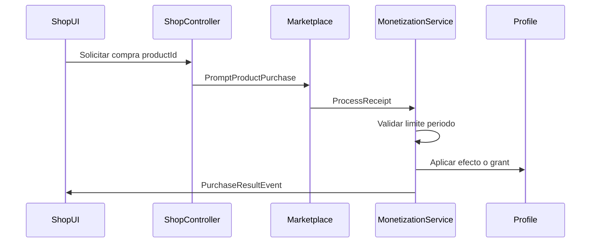

| Paso | Servidor |
|------|----------|
| 1 | Verificar límite de periodo no excedido |
| 2 | Procesar receipt Roblox |
| 3 | Aplicar boost / grant items / registrar pass |
| 4 | Persistir en ProfileStore |
| 5 | Notificar cliente |

**ProcessReceipt** idempotente: mismo receiptId no duplica entrega.

### 9.11 Balance económico — referencia v0.1

| Hito | Tiempo F2P | Gasto Brasas típico |
|------|------------|---------------------|
| Crear clan | ~2–3 días activo | 500 (ahorro nv. 10) |
| Cosmético fogata | ~2 días | 500 |
| Reparación express semanal | — | 50 × 7 = 350 max si usado daily |

**Ingreso Robux esperado:** modelo freemium suave; boosts opcionales para sesiones cortas; passes para jugadores recurrentes.

### 9.12 Interacción con otros sistemas

| Sistema | Relación |
|---------|----------|
| **§1.10** | Filosofía y límites; Cap. 9 numera precios |
| **Cap. 4** | Slots pass amplían inventario |
| **Cap. 7** | Crear clan 500 Brasas; escudo producto raid |
| **Cap. 8** | Dailies y logros generan Brasas |
| **Cap. 3** | Boost curación afecta regen; kit no cura estados |

### 9.13 Reglas de implementación (nota para Fase 2)

- Servicio: `MonetizationService`, `EconomyService` (Brasas)
- Roblox: `MarketplaceService`, `ProcessReceipt` en script dedicado
- Repositorio: `PlayerProfile.currency`, `PlayerProfile.monetization`
- Remotes: `PurchasePromptEvent` (cliente inicia), `PurchaseResultEvent`; **no** `FireServer` con Robux amount
- Tienda Brasas: `BuyShopItemEvent` validado servidor
- Auditoría: log compras para soporte

---

## 10. UX, UI y feedback

La UI es **pasiva**: muestra datos y captura intención del jugador. Nunca calcula recompensas, modifica inventario ni persiste datos. Todo flujo sigue **UI → Controller → Remote → Service** (reglas del proyecto).

### 10.1 Principios de UX

| Principio | Regla |
|-----------|-------|
| **Mobile-first** | Diseñar para touch; PC es adaptación con teclas |
| **Legibilidad** | Stats críticos visibles sin abrir menús |
| **3 taps máximo** | Acciones frecuentes (comer, craft básico, abrir cofre) en ≤3 taps |
| **Feedback inmediato** | Toda acción → respuesta visual/sonora en <200 ms |
| **No bloquear movimiento** | Menos modales fullscreen; paneles laterales/inferiores |
| **Accesibilidad** | Botones mín. 48×48 px; contraste alto; iconos + texto corto |
| **UI pasiva** | Sin lógica de negocio en LocalScripts de UI |

### 10.2 Identidad visual UI

| Elemento | Especificación |
|----------|----------------|
| **Estilo** | Supervivencia accesible; bordes redondeados suaves; texturas madera/hoja sutiles |
| **Paleta** | Verdes bosque, marrones tierra, ámbar fuego (alertas), rojo sangre (peligro), azul hielo (frío) |
| **Tipografía** | Gotham / Fredoka (legible en móvil); títulos bold, cuerpo regular |
| **Iconografía** | Siluetas claras: hambre, gota, termómetro, corazón, estados |
| **Animaciones** | Barras drenan suave; pulse en umbral crítico; shake leve en daño |

### 10.3 Arquitectura UI (proyecto)

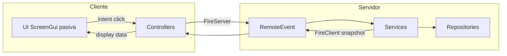

#### Controllers previstos (Fase 2)

| Controller | Responsabilidad UI |
|------------|-------------------|
| `UIController` | Orquestación HUD, perfil recibido *(existente)* |
| `SurvivalHUDController` | Barras vitales, estados |
| `InventoryController` | Inventario, hotbar, cofre |
| `CraftController` | Mesa craft, experimento |
| `BuildingController` | Modo construcción, preview |
| `MapController` | Mapa, biomas, raid target |
| `QuestController` | Journal, tracker misiones |
| `ClanController` | Panel clan, permisos |
| `TradeController` | Ventana intercambio |
| `ShopController` | Tienda Brasas + Robux |
| `DialogueController` | NPCs, tutorial prompts |
| `NotificationController` | Toasts, alertas raid |
| `LocalizationController` | Idioma activo, selector ajustes, refresh UI al cambiar locale |

**Componentes reutilizables** (`Shared/UI/` o `Controllers/Components/`): `StatBar`, `ItemSlot`, `QuestTracker`, `Toast`, `ConfirmModal`, `TabPanel`.

### 10.4 HUD — Siempre visible

Layout referencia (móvil portrait):

```
┌─────────────────────────────────────┐
│ [HP][Hambre][Sed][Temp]    [Reloj]  │  ← barra superior
│ [Estado icons...]                   │
│                                     │
│         (viewport juego)            │
│                                     │
│ [Misión activa - colapsable]        │
│ [Hotbar 1-6]              [Menú ☰]  │  ← barra inferior
└─────────────────────────────────────┘
```

#### Barras vitales (Cap. 3)

| Barra | Posición | Color | Umbral amarillo | Umbral rojo |
|-------|----------|-------|-----------------|-------------|
| **HP** | Izquierda 1 | Rojo/verde | ≤40 | ≤20 |
| **Hambre** | 2 | Naranja | ≤40 | ≤20 |
| **Sed** | 3 | Azul | ≤35 | ≤15 |
| **Temperatura** | 4 | Azul↔Rojo | ≤30 o ≥70 | ≤15 o ≥85 |

**Comportamiento:**
- Amarillo: icono pulse lento + sonido suave único por sesión.
- Rojo: pulse rápido + borde parpadeante + texto flotante ("¡Hambre!").
- Tap en barra → tooltip con causa sugerida ("Come algo" / "Busca fuego").

#### Iconos de estado activos

Fila bajo barras: `bleeding`, `poison`, `infection`, `wet`, `severe_cold`, `weak` (ayudante si panel abierto).

| Estado | Icono | Color |
|--------|-------|-------|
| Sangrado | Gota | Rojo |
| Veneno | Serpiente | Verde |
| Infección | Cruz | Naranja |
| Mojado | Ola | Azul |
| Frío severo | Copo | Cyan |

Tap → tooltip con cura recomendada (solo texto; no auto-cura).

#### Reloj día/noche

| Elemento | Detalle |
|----------|---------|
| Icono sol/luna | Transición con ciclo 20 min (Cap. 5) |
| Tooltip | "Noche en 3 min" |
| Alerta noche | Toast 30 s antes: "La temperatura bajará" |

#### Hotbar

| Slot | Contenido | Interacción |
|------|-----------|-------------|
| 1–6 | Items equipables/consumibles | Tap usar/equipar; long-press detalles |
| Indicador | Cantidad stack | Esquina del slot |

#### Tracker de misión

| Modo | Detalle |
|------|---------|
| **Expandido** | Nombre misión + progreso (2/5 madera) + pin mapa |
| **Colapsado** | Solo icono exclamación + mini barra |
| Tap | Abrir journal en pestaña misiones |

### 10.5 Menú principal (☰)

Panel lateral derecho; no pausa juego en exploración (overlay semitransparente).

| Entrada | Icono | Abre |
|---------|-------|------|
| Inventario | Mochila | §10.6 |
| Craft | Martillo | §10.7 |
| Mapa | Brújula | §10.8 |
| Journal | Libro | §10.9 |
| Campamento | Tienda | §10.10 |
| Ayudantes | Personas | §10.11 |
| Clan | Estandarte | §10.12 |
| Tienda | Monedas | §10.13 |
| Ajustes | Engranaje | Volumen, gráficos bajos |

### 10.6 Pantalla — Inventario

| Zona | Contenido |
|------|-----------|
| Grid | 16 slots (+4 pass); scroll vertical |
| Equipado | Herramienta + abrigo (slots fijos arriba) |
| Detalle item | Tap slot → panel: nombre, descripción, usar/equipar/soltar |
| Cofre | Si interactúa cofre: split view inventario ↔ cofre |
| Soltar | Confirmación modal; arrastrar fuera en PC |

**Intent:** `TransferItemEvent`, `EquipItemEvent`, `UseItemEvent` → `InventoryService`.

### 10.7 Pantalla — Craft

| Modo | UI |
|------|-----|
| **Recetas conocidas** | Lista categorías: herramientas, medicina, construcción, cocina |
| **Receta seleccionada** | Inputs con check verde/rojo; botón Craft |
| **Experimento** | 2–4 slots libres + botón Probar (Cap. 4) |
| **Estación** | Badge: manos / mesa / fogata / olla; gris si lejos |

Feedback craft exitoso: sonido chispa/martillo + item fly hacia inventario.

### 10.8 Pantalla — Mapa

| Elemento | Detalle |
|----------|---------|
| **Niebla** | Zonas no visitadas grises |
| **Biomas** | Colores: bosque verde, montaña gris, pantano oliva, costa azul |
| **Marcadores** | Parcela propia, misión, POI, evento dinámico |
| **Raid** | Campamentos nv.≥3 marcados; botón "Iniciar raid" con requisitos |
| **Leyenda** | Requisitos bioma al tap |

**Intent:** `StartRaidEvent` → `RaidService` (Cap. 7).

### 10.9 Pantalla — Journal

Pestañas: **Misiones** | **Recetas** | **Biomas** | **Ayudantes** | **Logros**

| Pestaña | Contenido |
|---------|-----------|
| Misiones | Principal, secundarias, diarias; recompensas |
| Recetas | Descubiertas / bloqueadas con pista textual |
| Biomas | Checklist descubiertos + recursos clave |
| Ayudantes | Lista vivos: hambre/salud; memorial perdidos |
| Logros | Progreso + recompensa cosmética |

### 10.10 Pantalla — Campamento

| Sección | Contenido |
|---------|-----------|
| **Nivel** | Camp nv. 0–4 + requisitos siguiente nivel |
| **Estructuras** | Lista colocadas + HP; botón reparar |
| **Modo build** | Toggle; lista blueprints en inventario |
| **Defensa** | Resumen muros, trampas, escudo activo |
| **Horario paz** | Toggle raid peace window (Cap. 7) |

**Intent:** `PlaceStructureEvent`, `RepairStructureEvent` → `CampService`.

### 10.11 Pantalla — Ayudantes

| Elemento | Detalle |
|----------|---------|
| Card por ayudante | Nombre, especialidad, hambre, salud, estado |
| Acciones | Alimentar, curar (lista items), Refugio/Trabajar |
| Cofre vinculado | Selector cofre auto-feed |
| Estación | Mini mapa parcela; tap asignar punto |

Alerta urgente: card borde rojo + toast si `weak` o HP crítico.

### 10.12 Pantalla — Clan

| Sección | Contenido |
|---------|-----------|
| Info | Nombre, miembros, parcela |
| Miembros | Lista + rol; invitar/expulsar (líder) |
| Cofre clan | Split inventario si en parcela |
| Misión semanal | Progreso coop |

### 10.13 Pantalla — Tienda

Dos pestañas: **Brasas** | **Robux**

| Pestaña | Contenido |
|---------|-----------|
| Brasas | Stock hub §9.3; saldo visible |
| Robux | Passes + products; timer límites; badge "Agotado" |

**Regla:** mostrar explícitamente límites ("2/2 hoy") y tiempo reset.

### 10.14 Tutorial — Overlays guiados

| Fase | UI |
|------|-----|
| Spotlight | Oscurece pantalla excepto elemento objetivo |
| Texto | Panel inferior: instrucción ≤12 palabras |
| Flecha | Apunta a nodo/recurso brillante en mundo |
| Progreso | Dots 1/8 pasos tutorial |
| Skip | No disponible en pasos 1–5; opcional después |

NPC guía o panel sin bloquear cámara en pasos finales.

### 10.15 Feedback sensorial

#### Audio (prioridad)

| Evento | Sonido |
|--------|--------|
| Hambre crítica | Estómago |
| Frío | Tiritar / viento |
| Sangrado | Latido bajo |
| Craft exitoso | Martillo/chispa |
| Raid entrante | Campana urgente |
| Muerte ayudante | Tono grave + silencio 1 s |
| Level up | Fanfarria corta |

#### Visual

| Evento | Efecto |
|--------|--------|
| Daño recibido | Borde rojo flash + vignette |
| Curación | Partículas verdes breves |
| Level up camp/jugador | Banner central 2 s |
| Loot recogido | Texto flotante +icono |
| Raid | Borde rojo persistente HUD + timer 8 min |

#### Toasts (NotificationController)

| Tipo | Duración | Ejemplo |
|------|----------|---------|
| Info | 3 s | "Receta descubierta" |
| Warning | 5 s | "Tu leñador tiene hambre" |
| Danger | Hasta actuar | "¡Raid en curso!" |
| Success | 3 s | "Misión completada" |

Cola máx. 3 toasts; danger reemplaza info.

### 10.16 Controles

#### Móvil (touch)

| Acción | Control |
|--------|---------|
| Mover | Joystick virtual (esquina inferior izq.) |
| Cámara | Deslizar derecha |
| Interactuar | Botón grande "Usar" contextual |
| Hotbar | Tap slots |
| Menú | ☰ |
| Build | Modo campamento → ghost + botones rotar/confirmar |

#### PC

| Acción | Tecla |
|--------|-------|
| Inventario | `Tab` o `I` |
| Craft | `C` |
| Mapa | `M` |
| Build | `B` |
| Rotar build | `R` |
| Interactuar | `E` |
| Hotbar | `1`–`6` |

**Regla:** toda acción PC debe tener equivalente en UI touch visible.

### 10.17 Estados de carga y error

| Estado | UI |
|--------|-----|
| Cargando perfil | Pantalla fogata animada + "Preparando campamento…" |
| Error datastore | "No pudimos cargar tu progreso. Reintentar" |
| Servidor lleno | Mensaje antes de kick |
| Compra Robux fallida | Toast + sin consumir límite |

### 10.18 Accesibilidad y rendimiento UI

| Regla | Detalle |
|-------|---------|
| **FPS UI** | Evitar loops en UI; usar TweenService |
| **Escalado** | UIScale por resolución; safe area notch móvil |
| **Reducir motion** | Setting desactiva shake/pulse |
| **Texto mínimo** | 14 px equivalente móvil |
| **Colorblind** | Iconos distintos además de color en estados |

### 10.19 Sincronización datos → UI

| Evento servidor | Actualiza |
|-----------------|-----------|
| `PlayerDataLoadedEvent` | Perfil inicial *(existente)* |
| `SurvivalUpdatedEvent` | Barras vitales, estados |
| `InventoryUpdatedEvent` | Inventario, hotbar, cofre |
| `QuestProgressEvent` | Journal, tracker |
| `CampUpdatedEvent` | Campamento, estructuras |
| `HelperUpdatedEvent` | Panel ayudantes |
| `RaidIncomingEvent` / `RaidResultEvent` | Alertas raid |
| `PurchaseResultEvent` | Tienda Robux |

El cliente **nunca** predice resultados; espera snapshot post-acción o muestra estado optimista solo en animaciones cosméticas.

### 10.20 Interacción con otros sistemas

| Capítulo | UI asociada |
|----------|-------------|
| Cap. 3 | HUD stats, estados, alertas |
| Cap. 4 | Inventario, craft, hotbar |
| Cap. 5 | Mapa, reloj, eventos |
| Cap. 6 | Build mode, campamento |
| Cap. 7 | Trade, clan, raid |
| Cap. 8 | Journal, tutorial overlays |
| Cap. 9 | Tienda Brasas/Robux |

### 10.21 Reglas de implementación (Fase 2)

- UI en `StarterGui` o `PlayerGui` creada por controllers; templates en `ReplicatedStorage.Shared.UI`
- Un ScreenGui por dominio (HUD, Menus, Modals, Toasts) para orden Z-index
- Controllers extienden `BaseController`; conexiones vía Trove
- Tipado estricto payloads eventos en `Shared/Types/`
- Tests manuales checklist: móvil 375px + PC 1920px
- **i18n:** probar HUD y menús en `en` y `es`; verificar fallback a `en`

### 10.22 Localización e idiomas (UI)

| Regla | Detalle |
|-------|---------|
| **Módulo** | `Shared/Localization/` — `Localization.luau` + tablas `Locales/en.luau`, `Locales/es.luau` |
| **API cliente** | `Localization.get(key)`, `Localization.format(key, params)`, `Localization.getLocale()` |
| **Default** | `"en"` si no hay preferencia |
| **Cambio de idioma** | Controller envía intent → Service valida y guarda `settings.locale` → UI refresca vía señal/evento |
| **Prohibido** | Strings visibles hardcodeados en controllers (excepto claves de debug internas) |
| **Items/recetas** | `displayName` en constants = clave i18n o lookup vía `Localization.get("item." .. id .. ".name")` |

#### Pantalla de ajustes — Idioma

| Opción UI (locale `en`) | Opción UI (locale `es`) | Valor guardado |
|-------------------------|---------------------------|----------------|
| English | English | `en` |
| Spanish | Español | `es` |

Al cambiar idioma, todos los ScreenGui activos reciben refresh (controllers suscritos a `LocaleChanged`).

---

## Historial de revisiones

| Versión | Fecha | Capítulos | Notas |
|---------|-------|-----------|-------|
| 0.1 | 2026-06-19 | 1–2 | Borrador inicial para revisión |
| 0.2 | 2026-06-19 | 1–2 | Añadido sistema de ayudantes (Pilar 5, §1.9, §2.13) |
| 0.3 | 2026-06-19 | 1–2 | Monetización ampliada: boosts temporales con límite por periodo (§1.10) |
| 0.4 | 2026-06-19 | 3 | Cap. 3 Supervivencia: stats, estados, muerte, ayudantes, balance v0.1 |
| 0.5 | 2026-06-19 | 4 | Cap. 4 Crafting e inventario: items, recetas, estaciones, reglas |
| 0.6 | 2026-06-19 | 5 | Cap. 5 Mundo: mapa, 4 biomas, nodos, fauna, clima, POIs |
| 0.7 | 2026-06-19 | 6 | Cap. 6 Campamento: parcelas, estructuras, niveles, ayudantes, defensa |
| 0.8 | 2026-06-19 | 7 | Cap. 7 Multijugador: clanes, comercio, raideo, escudos |
| 0.9 | 2026-06-19 | 8 | Cap. 8 Progresión: tutorial, misiones, XP, logros |
| 1.0 | 2026-06-19 | 9 | Cap. 9 Economía: Brasas, tienda, Game Passes, Developer Products |
| 1.1 | 2026-06-19 | 10 | Cap. 10 UX/UI: HUD, pantallas, feedback, controllers — **GDD completo** |
| 1.2 | 2026-06-19 | 1, 10 | Localización multilingüe: **EN default** + ES; extensible (§1.11, §10.22) |

---

## Estado del documento

**GDD v1.2 — Completo.** Incluye localización EN/ES (default EN).

**Implementación:** [`docs/Implementation-Plan.md`](Implementation-Plan.md) · specs en `openspec/specs/localization/`.
